##  Table of Contents
- [[#Table of Contents|Table of Contents]]
- [[#Pengantar|Pengantar]]
- [[#Prerequisite|Prerequisite]]
- [[#Data and Digital Use case|Data and Digital Use case]]
	- [[#Data and Digital Use case#Understanding Data in AI Contexts|Understanding Data in AI Contexts]]
	- [[#Data and Digital Use case#How AI work with Data|How AI work with Data]]
	- [[#Data and Digital Use case#Where to Get Data|Where to Get Data]]
- [[#Data Analysis and Preprocessing|Data Analysis and Preprocessing]]
	- [[#Data Analysis and Preprocessing#Data Preprocessing|Data Preprocessing]]
	- [[#Data Analysis and Preprocessing#EDA|EDA]]
	- [[#Data Analysis and Preprocessing#Statistical Analysis|Statistical Analysis]]
		- [[#Statistical Analysis#Descriptive Statistics|Descriptive Statistics]]
			- [[#Descriptive Statistics#Measure of Central Tendancy|Measure of Central Tendancy]]
			- [[#Descriptive Statistics#Measure of Variability/Dispersion|Measure of Variability/Dispersion]]
			- [[#Descriptive Statistics#Shape of Data|Shape of Data]]
		- [[#Statistical Analysis#Inferential Statistics|Inferential Statistics]]
	- [[#Data Analysis and Preprocessing#Feature Engineering|Feature Engineering]]
	- [[#Data Analysis and Preprocessing#Data Mining|Data Mining]]
- [[#Model and Evaluation|Model and Evaluation]]
	- [[#Model and Evaluation#Core Concepts of Machine Learning|Core Concepts of Machine Learning]]
	- [[#Model and Evaluation#Types of Machine Learning|Types of Machine Learning]]
	- [[#Model and Evaluation#Model Training and Evaluation data|Model Training and Evaluation data]]
	- [[#Model and Evaluation#Hyperparameter tuning|Hyperparameter tuning]]
	- [[#Model and Evaluation#Ensemble Learning|Ensemble Learning]]
- [[#Great Books on Everything Data and Machine Learning|Great Books on Everything Data and Machine Learning]]
	- [[#Great Books on Everything Data and Machine Learning#AI and Machine Learning|AI and Machine Learning]]
	- [[#Great Books on Everything Data and Machine Learning#Kaggle and Interviews|Kaggle and Interviews]]
	- [[#Great Books on Everything Data and Machine Learning#Statistics|Statistics]]
	- [[#Great Books on Everything Data and Machine Learning#Data Engineering|Data Engineering]]
	- [[#Great Books on Everything Data and Machine Learning#Productivity and Habits|Productivity and Habits]]

## Pengantar

Data dan kecerdasan buatan (AI) sekarang sudah jadi bagian penting di banyak bidang—bisnis, pendidikan, sampai riset ilmiah. Perkembangannya yang super cepat bikin kebutuhan akan orang yang paham data dan ML terus naik. Alhasil, kemampuan praktikal dalam data science dan machine learning jadi skill wajib buat mahasiswa maupun praktisi yang ingin membangun portofolio proyek yang solid.

Masalahnya, materi belajar tentang data dan AI itu tersebar dan sering tidak terstruktur. Di Indonesia sendiri, sumber yang ringkas, relevan, dan berbahasa Indonesia masih terbatas, sementara banyak pilihan belajar malah panjang, dan mahal, atau terlalu fokus ke teori. Akhirnya banyak orang bingung harus mulai dari mana, padahal yang dibutuhkan sebenarnya panduan praktis yang bisa langsung dipakai untuk ngerjain proyek, ikut kompetisi, atau membangun solusi AI sederhana.

Handbook ini disusun untuk menjawab kebutuhan tersebut. Dengan format yang compact, praktikal, dan mudah dipahami, buku ini membantu pembaca mempelajari dasar-dasar data science dan machine learning secara cepat dan tepat sasaran. Materinya dikurasi dari pengalaman langsung, baik dari perkuliahan data science maupun pengerjaan proyek di dunia kerja, sehingga pembaca bisa fokus pada konsep yang penting, applicable, dan yang paling penting berbahasa Indonesia.

Buku ini cocok untuk kamu yang ingin:

- Memulai proyek ML pertama
- Persiapan lomba AI/data science
- Persiapan magang di bidang Data/AI
- Implementasi solusi AI untuk tugas kuliah atau skripsi
- Membuat Proof of Concept untuk startup/ide bisnis AI

>This ebook is 75% written by humans and 25% AI-assisted. The percentage reflects the overall time spent on curating references, organizing the material, refining explanations, and crafting the final wording. The AI assistance is used mainly to speed up drafting and rephrasing, while the core ideas, structure, and content direction remain human-driven.

---

gambar perbedaan AI/ML/DS sebagai dasar

---

## Prerequisite

Python jadi pilihan utama di AI karena syntaxnya paling mudah dipelajari dan struktur-nya mendekati bahasa manusia—jadi kamu bisa langsung fokus ke problem solving tanpa tersangkut detail teknis. Kemudahan ini bikin prototyping berjalan cepat, dan speed itu penting banget dalam AI development yang sifatnya iteratif dan butuh banyak trial-and-error.

Terus, ekosistem Python untuk AI itu beneran lengkap. PyTorch dan TensorFlow dipakai untuk bangun neural networks, scikit-learn jadi standar untuk machine learning klasik seperti regression, classification, clustering, sementara NumPy dan Pandas menangani data processing sebelum training. Koleksi library yang terus berkembang dan saling terintegrasi inilah yang membuat Python tetap jadi first choice di riset dan development AI.

## Data and Digital Use case
^[Jadi ini tuh bakal bahasa apa itu data, format, jenis dan bentuknya serta fundamentalnya dalam konteks AI, bagaimana cara mengolah dan menggunakanya (digunakan untuk apa dan mengapa)]
### Understanding Data in AI Contexts

Dalam dunia AI, data adalah bahan baku utama yang memberi “pengetahuan” bagi mesin untuk belajar dan membuat keputusan.

Data digunakan untuk melatih model AI agar mengenali pola, memprediksi hasil, dan memberikan solusi berbasis pengalaman sebelumnya. Formatnya tidak hanya berupa teks, tetapi juga mencakup angka, gambar, suara, dan video. Semakin banyak dan semakin berkualitas data yang digunakan, semakin baik pula performa dari si model AI.

| Jenis Data           | Penjelasan                                                      | Contoh Penggunaan                                                    |
| -------------------- | --------------------------------------------------------------- | -------------------------------------------------------------------- |
| Structured Data      | Data tabel dengan format tetap (misalnya CSV, database).        | Data pelanggan untuk prediksi churn atau transaksi keuangan.         |
| Semi-structured Data | Tidak seketat tabel, masih punya struktur (misalnya JSON, XML). | Log API, file sensor IoT, data chatbot.                              |
| Unstructured Data    | Tidak punya format tetap seperti teks, gambar, audio, video.    | Analisis sentimen media sosial, pengenalan wajah, transkripsi suara. |
| Synthetic Data       | Data buatan yang menyerupai data asli untuk melatih model.      | Latihan AI generatif tanpa melibatkan data pengguna nyata.           |

Jenis sumber data sangat beragam, mulai dari sensor IoT, media sosial, hingga sistem internal. Tiap sumber punya format dan kualitas berbeda yang perlu dikelola dengan tepat.

Dari sisi engineering, pembuat proyek perlu memahami cara data dikumpulkan dan diolah agar bisa dimanfaatkan secara efektif dalam pengembangan AI.
### How AI Uses Data

If the data is already, How AI Leverages data to learn, adapt, and deliver the best outcomes?

- **Training AI Models**: Untuk membangun model AI yang efektif, data digunakan sebagai bahan pelatihan. Contohnya pada NLP, model dilatih menggunakan kumpulan besar data teks agar mampu memahami tata bahasa, makna kata, hingga analisis sentimen.
- **Data-Driven Decision Making**: Data yang berkualitas memungkinkan sistem AI membuat keputusan secara akurat dan real-time. Sebagai contoh, mobil otonom memanfaatkan data dari berbagai sensor untuk mengenali lingkungan dan menavigasi jalan dengan aman. Contoh lainnya, market analysis bot menggunakan data transaksi, tren harga, dan sentimen pasar untuk memberikan rekomendasi investasi.
- **Personalization and Recommendations** - Algoritma AI menggunakan data perilaku dan preferensi pengguna untuk menghasilkan pengalaman yang lebih personal. Contohnya Algoritma konten di Tiktok.

### Where to Get Data

Public Datasets: Free and accessible.

- [Kaggle](https://www.kaggle.com/datasets): Nyediain ribuan dataset unggahan pengguna dan kompetisi analisis data, untuk pemula serta dataset lanjutan untuk ML dan AI tingkat lanjut.​
- [UCI Machine Learning Repository](https://archive.ics.uci.edu): Menampilkan banyak dataset klasik untuk keperluan riset dan pelatihan model, seperti MNIST dan Iris
- [Google Dataset Search](https://datasetsearch.research.google.com): Mesin pencari khusus untuk dataset lintas bidang, sehingga mudah menemukan dataset dari berbagai sumber open source
- DataHub & Open Data Hub: Katalog dataset dari berbagai sektor skala internasional.
- [World Bank](https://data.worldbank.org): Kumpulan dataset lintas negara dan bidang pembangunan.
- Portal Pemerintah ([Data.go.id](https://data.go.id), [DataIndonesia.id](https://dataindonesia.id), [BPS](https://www.bps.go.id)):
- [Huggingface datasets](https://huggingface.co/datasets)
- [Stanford Large Network Dataset Collection (SNAP)](https://snap.stanford.edu/data)
- [Amazon AWS Public Datasets](https://registry.opendata.aws)

API-Based Sources: Real-time data pulls.

- Twitter API for sentiment analysis data; OpenWeatherMap for climate data.
- Custom Sources: Collect your own via surveys, sensors, or web scraping (ethically and legally).

**Checklist for Data**

□ Define your project's data needs (e.g., volume, type).
□ Assess data quality: Is it accurate, complete, and unbiased?
□ Document sources and preprocessing steps.

**Resources and whats next**

- [https://mitsloan.mit.edu/ideas-made-to-matter/machine-learning-and-generative-ai-what-are-they-good-for](https://mitsloan.mit.edu/ideas-made-to-matter/machine-learning-and-generative-ai-what-are-they-good-for)
- [https://www.potterclarkson.com/insights/what-data-is-used-to-train-an-ai-where-does-it-come-from-and-who-owns-it](https://www.potterclarkson.com/insights/what-data-is-used-to-train-an-ai-where-does-it-come-from-and-who-owns-it/)

==final penutup dari data ini perlu diperbaiki, supaya catatan ini lebih kepake==
## Data Analysis and Preprocessing

### Data Preprocessing
^[teknik-teknik pada data processsing berdasarkan skenario sering ditemuin pada dataset, bagaimana cara memperoleh insight dan menangkap pola dari data melalui visualisasi dan perhitungan statistik, lalu ditutup dengan prompt yang bisa dicoba untuk analisis data ]

Data preprocessing merupakan tahap krusial pada tahap awal dari persiapan data. Sebelum membangun model AI yang efektif, data harus benar-benar siap dan telah melalui serangkaian proses pembersihan serta transformasi.

Pada tahap ini, data mentah diolah menjadi bentuk yang lebih bersih, konsisten, dan terstruktur agar model dapat belajar dengan optimal dan menghasilkan prediksi yang akurat.

“If 80 percent of our work is data preparation, then ensuring data quality is the important work of a machine learning team.”
– Andrew Ng

Proses preprocessing mencakup berbagai aktivitas seperti penanganan missing values, deteksi outlier, normalisasi data, encoding kategorikal, hingga feature engineering. Setiap dataset memiliki karakteristik unik, sehingga teknik yang diterapkan perlu disesuaikan dengan konteks dan tujuan analisis spesifik. Berikut beberapa skenario umum yang sering ditemui beserta cara penanganannya:

**Bagaimana jika data punyaku ga lengkap?** (Missing Value Handling)

Seringkali data yang kita dapatkan memiliki beberapa atau banyak nilai kosong, dan ini tidak boleh dibiarkan karena dapat memengaruhi performa model, terutama model yang sensitif terhadap distribusi data seperti regresi, tree-based model tanpa imputation yang tepat, maupun algoritma jarak seperti KNN. Nilai kosong dapat membuat prediksi model menjadi bias atau tidak stabil jika tidak ditangani.

Beberapa alasan umum mengapa data bisa kosong:

- Lupa mengisi suatu baris data.
- Data hilang saat proses migrasi atau transfer.
- Kesalahan pemrograman.
- User memilih tidak mengisi data tertentu karena alasan privasi atau hal lain.

Dalam praktiknya, nilai kosong dapat ditangani dengan dua pendekatan utama: menghapus data atau mengisinya kembali. Jika jumlah nilai kosong tidak terlalu besar, baris atau kolom yang hilang bisa dihapus tanpa menambah bias berarti. Namun jika datanya penting, nilai kosong dapat diisi menggunakan mean, median, atau mode—sesuai tipe datanya. Pendekatan ini cocok dengan implementasi Python di bawah, yang biasanya menggunakan `dropna()` untuk menghapus data dan `fillna()` atau `SimpleImputer` untuk melakukan imputasi.

```python
from sklearn.impute import SimpleImputer, IterativeImputer

# Descriptive statistic
SimpleImputer(strategy='mean')           # rata-rata
SimpleImputer(strategy='median')         # median (robust untuk outlier)
SimpleImputer(strategy='most_frequent')  # mode (untuk kategorikal)

# Interpolation - estimasi berdasarkan trend data
df['column_2'].interpolate(method='linear')              
df['column_2'].interpolate(method='polynomial', order=2)

# Iterative Imputation - prediksi dari fitur lain (paling akurat)
IterativeImputer(max_iter=10).fit_transform(df)
```

Namun pada praktiknya, data yang hilang belum tentu cocok diisi dengan nilai statistik sederhana, tergantung pola dan konteks datanya.

**Fitur data milikku tidak seimbang? (Imbalance Dataset)**
Pada data klasifikasi yang jumlah kelasnya timpang, model cenderung bias terhadap kelas mayoritas. Cara umum mengatasinya yaitu oversampling, undersampling, atau membuat bobot kelas saat training.

```python
from imblearn.over_sampling import RandomOverSampler, SMOTE
from imblearn.under_sampling import RandomUnderSampler

# Oversampling sederhana
X_res, y_res = RandomOverSampler().fit_resample(X, y)

# SMOTE (sintetik)
X_res, y_res = SMOTE().fit_resample(X, y)

# Undersampling mayoritas
X_res, y_res = RandomUnderSampler().fit_resample(X, y)

# Class weight (untuk model tertentu)
model = LogisticRegression(class_weight='balanced')
```

**Pada data yang kumiliki ada bbrapa point yang terlalu berbeda… (Outlier Handling)**
Outlier bisa memengaruhi model, terutama model yang sensitif terhadap nilai ekstrem. 

==ngasih teori ttg outlier==


Cara umum yaitu trimming, winsorizing, censoring, dan transformasi.

There are several techniques to detect the outliers. In which most important and generally used technique to detect outliers is

- Using Visualization plots such as boxplot and scatter plot
- using the normal Distribution (mean and std dev).

```python
df = data.copy()

IQR = df['Age'].quantile(0.75) - df['Age'].quantile(0.25)

lower = df['Age'].quantile(0.25) - 1.5* IQR
upper = df['Age'].quantile(0.75) + 1.5* IQR

outliers = np.where(df['Age']>upper,True, np.where(df['Age']<lower,True,False))

df = df.loc[~(outliers)]
```

```python
# or you can write in this way too..
df = df[~((df['Age']<lower) & (df['Age']>upper))]
#df
```

Other ways to handle outliers:

1. **_Remove the outliers:_** Before deleting the entries having outliers, make sure the they aren’t adding any significant information and also that the dataset is not too small as deleting rows from datasets with a smaller number of records would mean losing vital information.
2. **_Imputation with Mean/Median/Mode:_** Replace the outliers with any of the measures of central tendency just as we do in missing value imputation.
3. **_Quantile based flooring:_** This method is like squeezing the far-off values so that they fall within the range.
4. **_Transformation:_** If the data is skewed, applying logarithmic, square or square root transformation might help.

==tambahkan callout untuk detail handling outlier==

==sek, effort nih nyajiin cara outlier handling==

Lebih jauh tentang outliers

Outlier can be of two types:
1) Univariate
2) Multivariate.
Univariate outliers can be found when we look at distribution of a single variable. Multi-variate outliers are outliers in an n-dimensional space. In order to find them, you have to look at distributions in multi-dimensions.


**Terdapat bbrp data yang sama (Duplikasi data )**
Data duplikat bisa membuat pola statistik terdistorsi. Solusinya yaitu pemeriksaan baris identik atau duplikasi berdasarkan subset kolom tertentu.
```python
# Cek duplikasi
df.duplicated().sum()

# Hapus duplikasi seluruh kolom
df = df.drop_duplicates()

# Hapus duplikasi berdasarkan kolom tertentu
df = df.drop_duplicates(subset=['name','date'])
```

**Format data tidak konsisten? (Inconsistent Data Format)**
Perbedaan format tanggal, satuan, atau kapitalisasi bisa mengacaukan analisis. Hal umum adalah normalisasi format.

```python
import pandas as pd

# Tanggal ke format seragam
df['date'] = pd.to_datetime(df['date'], errors='coerce')

# Normalisasi teks
df['city'] = df['city'].str.strip().str.lower()

# Konversi satuan (misal cm → m)
df['height_m'] = df['height'].str.replace('cm','').astype(float) / 100
```

**Bagaimana cara kalkulasi data kategorikal? (Encoding)**
Komputer tidak bisa memproses [data kategorikal](https://developers.google.com/machine-learning/crash-course/categorical-data). Oleh karena itu harus dirubah menjadi angka sebelum masuk model. Ada beberapa metode tergantung data dan kebutuhan handling model.


```python
from sklearn.preprocessing import OneHotEncoder, LabelEncoder
import pandas as pd

# Label Encoding
df['gender_le'] = LabelEncoder().fit_transform(df['gender'])
# Expected output (contoh):
#   gender   gender_le
#   male         1
#   female       0

# One-hot Encoding
df = pd.get_dummies(df, columns=['disease'])
# Expected output (contoh):
#   disease_flu   disease_covid   disease_dbd
#        1              0               0
#        0              1               0
#        0              0               1

# Target encoding sederhana
means = df.groupby('category')['target'].mean()
df['category_te'] = df['category'].map(means)
# Expected output (contoh):
#   category   target   category_te
#      A         1          0.72
#      B         0          0.30
#      A         0          0.45
```

Tiga metode di atas adalah yang paling umum dipakai pada kebanyakan data, namun masih banyak teknik encoding lain seperti ordinal encoding, binary encoding, hashing trick, atau count encoding—pemilihannya bergantung pada jumlah kategori, struktur datanya, dan kebutuhan model. 


Dalam praktiknya ada banyak sekali skenario preprocessing di luar yang telah dibahas—mis. format tidak konsisten, missing values, imbalance, outlier, duplikasi, noise, dan data leakage. Teknik yang dipilih bergantung pada tujuan analisis atau model, karakteristik data, dan trade-off (akurasi vs interpretabilitas vs kompleksitas). Selalu uji efek preprocessing pada data validasi/tes dan dokumentasikan langkah yang diambil.

> [!NOTE] Use Case Prompt for Analysis Scenario
> - “Summarize this dataset for me. What trends or anomalies do you see?”
> - “Review this analysis. Are there any missing considerations or biases?”
> - “Create visualization ideas for this dataset.”
> - “Suggest SQL queries for this scenario.”
> - “Explain this complex metric in simple terms.”
> - “Draft an executive summary for my findings.”

%%
https://www.kaggle.com/code/rtatman/data-cleaning-challenge-outliers
https://www.kaggle.com/discussions/general/228307
https://www.kaggle.com/code/shahules/an-overview-of-encoding-techniques
https://www.kaggle.com/code/alirezahasannejad/data-preprocessing-in-machine-learning#7--Feature-scaling

%%
### EDA
^[jenis jenis EDA dan bagaimana cara menanganinya, untuk vidualisasi bbrp library yg bisa dipake apa aja]
==problem dari EDA ini aku rasa kurang klep deh, sama yg lain==


> [!NOTE] Data Preprocesssing dulu, apa EDA?
> - Biasanya proses yang dilakukan adalah: mulai dari EDA dulu secara ringan, lalu data preprocessing—dan kedua langkah ini sering dilakukan secara iteratif dan saling melengkapi sesuai kebutuhan data dan tujuan analisis.​​​

EDA adalah proses eksplorasi data untuk menemukan pola, anomali, dan insight, sebelum kita masuk ke tahap modelling. Data visualization dan EDA merupakan kombinasi yang powerful untuk memahami karakteristik dataset kita. Berikut pendekatan yang bisa kamu terapkan:

1. **Univariate Analysis:** Gunakan [Histogram](https://id.wikipedia.org/wiki/Histogram) dan [Bar Chart](https://en.wikipedia.org/wiki/Bar_chart) untuk visualisasi distribusi dan varians tiap variabel
2. **Correlation Analysis:** Heatmap membantu identifikasi variabel yang highly correlated dan mengurangi masalah [multikolinearitas](https://en.wikipedia.org/wiki/Multicollinearity)
3. **Bivariate Analysis:** Box plot dan Grouped bar chart untuk melihat hubungan antar variabel independen dengan variabel target

**Univariate Analysis – Histogram and Bar Chart**

To obtain an overview of distribution, firstly let’s classify features in to categorical and numerical variables, then visualize categorical features using bar chart and numerical features using histogram. Visualizing the distribution gives suggestions on whether the data points are more dense or more spread out, hence whether the variance is low or high. Low variance features tend to contribute less to the prediction of outcome variable.

**Correlation Analysis – Heatmap**

Misal kita mau menggunakan model logistic regression, untuk mencari tahu fitur mana yang paling mirip dan berkorelasi tinggi

Some algorithms demands the absence of collinearity in explanatory variables, including logistic regression which will be used for this exercise. Therefore, eliminating highly correlated features is an essential step to avoid this potential pitfall. Correlation analysis with heatmap visualization highlights pairs of features with high correlation coefficient.

```python
# correlation analysis
plt.figure(figsize = (20,20))

correlation = df.corr()
sns.heatmap(correlation, cmap = “GnBu", annot = True)
```

==tambah contoh plot beserta kesimpulan pendeknya==
**Bivariate Analysis – Box Plot and Grouped Bar Chart**

Setelah korelasi tiap variabel. Untuk fitur kategorikal gunakan grouped bar chart, sementara untuk variabel numerik gunakan box plot. Eksplorasi ini juga mempermudah statistical tests yang digunakan dalam filter methods, seperti Chi-Square dan ANOVA test.

> _**Grouped bar chart is used as the visual representation of Chi-Square Analysis**_

Tiap independen variab
Each independent variable is set as the primary category. The target variable is set be be the secondary category using hue = "Attrition_Flag". As the result, it depicts whether the "Attrition_Flag" would vary in distribution across different level of the primary category. If two variables are independent, then we would expect the distribution to be the same across all levels.

This is the same logic as Chi-Square test which calculates the difference between the observed value and expected value based on the assumption of independency. If there are no or little dependencies existing, we expect the ratio of each group of bars to be proportional to the ratio of attrited customers vs. existing customers. If the ratio is significantly different, then it suggests a high disparity between the observed value and expected value, which means high Chi-Square value, hence rejects the hypothesis that two variables are independent.

After plotting all category variables against the target label, I found that _"Card_Category"_ seems to display a variation in ratio across _Blue, Gold, Silver and Platinum_. In the following section, we will find out if this is true according to the quantitative scoring based on filter method.

```python
# grouped bar chart
for 1 in range(8, len(cat_list)):
	primary_cat = cat_list[i]
	plt.figure (figsize = (8,8))
	chart = sns.countplot(
		data = df,
		primary_cat,
		hue= "Attrition_Flag",
		palette = 'GnBu’,
```

==callout, library EDA untuk data visualization bisa baca kode ini https://www.kaggle.com/code/berkayalan/data-visualization-guide-with-5-libraries-eda==

%%
https://towardsdatascience.com/feature-selection-and-eda-in-python-c6c4eb1058a3/
https://www.kaggle.com/code/berkayalan/data-visualization-guide-with-5-libraries-eda
%%
### Statistical Analysis
^[jabaran dari 2 jenis metode beserta teori teori di dalamnya, statisticnya]

Data cleaning dan processing itu penting, tetapi statistik tidak kalah esensial. Statistik merupakan metode matematika yang digunakan untuk memahami, menjelaskan, dan menjawab berbagai pertanyaan terkait data. Melalui statistik, data yang sudah diproses dapat dianalisis secara terukur sehingga menghasilkan insight yang valid dan dapat dipertanggungjawabkan

Mengapa penting dalam ML?

Dari exploratory data analysis hingga perancangan eksperimen untuk pengujian hipotesis, statistik berperan besar dalam pemecahan masalah di berbagai industri dan domain. Statistik membantu menjawab pertanyaan seperti:

- Fitur apa yang paling penting?
- Bagaimana kita merancang eksperimen untuk strategi pengembangan produk?
- Metrik performa apa yang perlu diukur?
- Hasil apa yang paling umum atau paling mungkin terjadi?
- Bagaimana membedakan antara noise dan data yang benar-benar valid?


> [!NOTE] 
> Selain Python (pandas, numpy, statsmodels), kita juga bisa menggunakan R untuk analisis data. Beberapa library yang umum digunakan antara lain:
>- dplyr untuk data manipulation
>- ggplot2 untuk data visualization
>- tidyr untuk data cleaning dan reshaping
>- readr untuk data loading
>- caret untuk modeling dan evaluasi


![[Pasted image 20251123005534.png | Types Statistics In Data Analysis]]

#### Descriptive Statistics

Metode dalam statistika untuk digunakan untuk memahami data secara langsung, dengan meringkasnya melalui ukuran-ukuran seperti rata-rata, median, modus, standar deviasi, dan rentang. Metode awal ini cocok sebagai langkah awal eksplorasi sebelum dilakukan analisis lebih dalam.

```python
# library python yang sering digunakan pada statistical analysis
import math               # operasi matematika
import numpy as np        # array & komputasi numerik
import pandas as pd       # data tabel
import statistics         # statistik dasar
import scipy.stats        # fungsi statistik
import matplotlib.pyplot as plt  # visualisasi
import seaborn as sns     # visualisasi 
```

##### Measure of Central Tendancy

Ketika kamu punya dataset dengan jumlah baris yang banyak, ratusan baris misalkan, kamu akan butuh nilai yang merepresentasikan keseluruhan data, seperti "berapa harga rumah tipikal?" atau "gaji rata-rata karyawan berapa?". Measure of central tendency memberikan nilai "pusat" ini: mean (rata-rata), median (nilai tengah), dan mode (nilai paling sering muncul). Berguna untuk quick summary, membandingkan grup data, atau sebagai baseline untuk deteksi outlier.

```python
numeric_data = df.select_dtypes(exclude='object')
categorical_data = df.select_dtypes(include='object')
```

Kode di atas memisahkan kolom numerik dan kategorikal dari dataframe. Ini langkah umum dalam analisis data, karena operasi statistik seperti mean atau variance hanya bisa diterapkan pada data numerik, sementara data kategorikal memerlukan treatment yang berbeda.

```python
# Mean of all the columns in dataframe
df.mean()

# Mean of individual column of dataframe
df['column_1'].mean()

# - The Geometric Mean (GM) is the average value or mean which signifies the central tendency of the set of numbers by finding the product of their values.
from scipy.stats import gmean
gmean(df['column_1'])

# - The Harmonic Mean (HM) is defined as the reciprocal of the average of the reciprocals of the data values
statistics.harmonic_mean(df['column_1'])
```

**Mean (Rata-rata)** adalah ukuran central tendency yang paling umum digunakan. Ada tiga jenis mean yang bisa kita hitung:
- **Arithmetic mean** (`.mean()`): Rata-rata biasa, menjumlahkan semua nilai lalu dibagi jumlah data. Paling sering dipakai untuk data yang terdistribusi normal.
- **Geometric mean** (`gmean()`): Lebih cocok untuk data yang bersifat multiplikatif atau rasio, seperti growth rate atau return on investment.
- **Harmonic mean** (`harmonic_mean()`): Berguna untuk rata-rata dari rasio atau rate, misalnya kecepatan rata-rata.

Selain mean, ukuran lainnya seperti **median** (nilai tengah) dan **mode** (nilai yang paling sering muncul) juga penting untuk menggambarkan persebaran data secara lebih lengkap.

```python
df['column_1'].describe()  # Memberikan count, mean, std, min, Q1, median, Q3, max

df.mode() # Nilai yang sering muncul

statistics.median(df['column_1']) # Nilai tengah

from scipy.stats import trim_mean
trim_mean(df['column_1'], 0.1)  # Membuang 10% data outlier

df['column_1'].quantile(0.25)  # Q1 (kuartil pertama)
df['column_1'].quantile(0.50)  # Q2 (sama dengan median)
df['column_1'].quantile(0.75)  # Q3 (kuartil ketiga)
```

##### Measure of Variability/Dispersion

Selain mengetahui nilai pusat data, kita juga perlu memahami seberapa tersebar datanya. Pengukuran [Variabilitas](https://en.wikipedia.org/wiki/Variability)/[Dispersi](https://en.wikipedia.org/wiki/Statistical_dispersion) memberikan informasi tentang bagaimana data bervariasi atau tersebar di sekitar nilai tengahnya. Semakin besar variabilitas, semakin beragam nilai-nilai dalam dataset.

**Varians** mengukur seberapa jauh nilai-nilai individual dalam dataset dari mean-nya. Variance yang tinggi menunjukkan data sangat bervariasi dan tersebar luas, sedangkan variance rendah menandakan data cenderung berkumpul dekat dengan mean.

$$\text{Variance} = \frac{\sum_{i=1}^{n}(x_i - \bar{x})^2}{n}$$

Tujuan akhirnya adalah memberi gambaran seberapa konsisten atau tidaknya data tersebut, sehingga kita bisa menilai apakah dataset tersebut cenderung stabil atau justru berubah-ubah.

**Standard Deviation** adalah akar kuadrat dari varians. Karena satuannya sama dengan data asli, standard deviation lebih mudah diinterpretasikan dibanding varians. Misalnya, jika data kita dalam satuan meter, standard deviation juga dalam meter.

$$\text{Standard Deviation} = \sqrt{\text{Variance}} = \sqrt{\frac{\sum_{i=1}^{n}(x_i - \bar{x})^2}{n}}$$

**Range** ngasih gambaran kasar tentang spread dengan melihat selisih nilai terbesar dan terkecil. Namun, range sangat sensitif terhadap outlier.

$$\text{Range} = x_{\text{max}} - x_{\text{min}}$$

**IQR (Interquartile Range)** lebih robust terhadap outlier karena hanya melihat 50% data di tengah (antara kuartil pertama dan ketiga). IQR sering digunakan untuk deteksi outlier dengan aturan: nilai yang berada di luar `Q1 - 1.5*IQR` atau `Q3 + 1.5*IQR` dianggap sebagai outlier potensial.

$$\text{IQR} = Q_3 - Q_1$$

**Kurtosis** mengukur seberapa “runcing” atau “datar” distribusi data dibanding distribusi normal. Nilai kurtosis tinggi menunjukkan banyak outlier (heavy tails), sedangkan kurtosis rendah berarti distribusi lebih datar dan ringan.

$$\text{Kurtosis} = \frac{\sum_{i=1}^{n}(x_i - \bar{x})^4}{n \cdot \sigma^4} - 3$$

```python
# Variance - mengukur seberapa jauh data tersebar dari mean
df['column_1'].var()
statisics.variance(df['column_1'])

# Standard Deviation - akar dari variance, lebih mudah diinterpretasi
df['column_1'].std()

# Range - selisih antara nilai maksimum dan minimum
df['column_1'].max() - df['column_1'].min()

# Interquartile Range (IQR) - range dari 50% data di tengah
Q1 = df['column_1'].quantile(0.25)
Q3 = df['column_1'].quantile(0.75)
IQR = Q3 - Q1
```
#### Inferential Statistics

Statisika inferensia adalah tahap dimana analisa data didapat dari merangkum data yang ada (statistik deskriptif) ke membuat kesimpulan yang lebih luas dan pengambilan keputusan berbasis bukti mengenai sumber daya yang lebih besar (populasi).

![[Pasted image 20251123102030.png]]

> [!info] Bedanya Populasi dan Sampel
> **Populasi** adalah keseluruhan kelompok yang ingin kita teliti, biasanya terlalu besar untuk diperiksa satu per satu, Sehingga diambillah sebagian data yang merepresentasikan keseluruhan data. **Sampel** adalah subset representatif dari populasi tersebut yang kita pilih untuk dianalisis. Dengan sampel yang tepat, kita bisa menarik kesimpulan tentang populasi tanpa harus memeriksa setiap elemennya.

==mbahas sampling singkat aja nih, dan contoh use case rill==

```python
import numpy as np

#random sampling
data.sample(5)

# systematic sampling
k = 5 # Ambil setiap elemen ke-5
indeks_sistematis = np.arange(0, len(df), k)
sampel_sistematis = data.iloc[indeks_sistematis]
```

**Confidence interval** 
##### Inferential Statistics

**Confidence Interval** Confidence interval kasih kita range nilai yang kemungkinan besar mengandung parameter populasi sebenarnya (misalnya mean populasi). Biasanya pakai 95% confidence level, artinya kalau kita ambil 100 sample berbeda, sekitar 95 di antaranya bakal punya interval yang mengandung nilai sebenarnya.

$$\text{CI} = \bar{x} \pm Z \cdot \frac{\sigma}{\sqrt{n}}$$

**Hypothesis Testing** Hypothesis testing adalah cara formal buat ngecek apakah suatu klaim tentang data itu valid atau ngga. Kita mulai dengan dua hipotesis: null hypothesis (H₀) yang bilang "ga ada efek/perbedaan" dan alternative hypothesis (H₁) yang bilang sebaliknya. Kita pakai data untuk decide mana yang lebih masuk akal.

Contoh sederhana: test apakah rata-rata nilai kelas A beda signifikan dari kelas B.

$$t = \frac{\bar{x} - \mu_0}{SE}$$

> [!NOTE] 
> Kalau mau explore lebih dalam tentang inferensial statistik di Python terutama analisis confidence interval dan hypothesis testing, kamu bisa cek repo salah satu temanku disini: https://github.com/devanshmalik/Inferential-Stats-in-Python/tree/master

**Standard Error** Standard error (SE) ngukur seberapa akurat sample mean kita sebagai estimasi dari true population mean. Semakin besar sample size, semakin kecil SE—artinya estimasi kita semakin reliable. Ini bedanya sama standard deviation: SD ngukur variasi data, SE ngukur variasi dari estimasi kita.

$$SE = \frac{\sigma}{\sqrt{n}}$$

```python
import numpy as np
from scipy import stats

# Confidence Interval (95%)
mean = np.mean(data)
std_error = stats.sem(data)  # Standard Error of Mean
confidence_level = 0.95
ci = stats.t.interval(confidence_level, 
                      len(data)-1,  # degrees of freedom
                      loc=mean, 
                      scale=std_error)

# Hypothesis Testing (One-sample t-test)
# H0: population mean = 30
# H1: population mean ≠ 30
hypothesized_mean = 30
t_statistic, p_value = stats.ttest_1samp(data, hypothesized_mean)
```
==contoh penggunaan inferensial dan deskriptif dalam data==

Dalam konteks proyek data dan AI, analisis statistik memberikan dasar pemahaman terhadap pola, tren, dan hubungan dalam data. Tahapan seperti deskriptif, inferensial, hingga pengujian hipotesis membantu memastikan keputusan berbasis data dilakukan secara objektif dan terukur. Dengan kata lain, statistik melengkapi proses data cleaning dan processing dengan memberikan makna yang dapat langsung dipakai untuk permodelan dan evaluasi.

%%
https://www.kaggle.com/code/shivanirana63/guide-to-complete-statistical-analysis#2.Inferential-Statistics
https://pandas.pydata.org/docs/getting_started/intro_tutorials/06_calculate_statistics.html
https://scipy-lectures.org/packages/statistics/
https://www.statsmodels.org/stable/gettingstarted.html
https://www.itl.nist.gov/div898/handbook/index.htm
%%

### Feature Engineering
^[jenis-jenis dan penjabarannya]

Feature engineering adalah bagian dari data preprocessing, tapi ini adalah part yang paling spesifik dan membutuhkan domain knowledge yang dalam. Berbeda dengan proses cleaning atau normalisasi data yang bisa mengikuti standard procedure, feature engineering requires pemahaman tentang problem domain, kamu perlu tahu fitur mana yang benar-benar meaningful dan bagaimana cara mengekstrak signal dari noise.

> Buat yang masih bingung feature (fitur) itu apa, basically column pada data

Dalam praktiknya, terutama ketika dealing dengan dataset besar (ratusan ribu hingga jutaan rows dengan puluhan atau ratusan features), approach feature engineering perlu ketelitian. Salah handling bisa bikin model overfitting, underfitting, atau bahkan completely misleading. M

Ada banyak teknik dalam feature engineering, dari feature selection hingga synthetic data generation. Di handbook ini, kita fokus ke teknik yang paling sering dipakai dan directly applicable.

1. **Feature Selection** 

Memilih subset features yang paling relevan dari dataset. Tujuannya mengurangi noise, mempercepat training, dan improve model performance. Bayangin kamu punya 100 kolom tapi cuma 15 yang beneran ngaruh—sisanya cuma bikin model bingung.

Ada 2 pendekatan utama dalam feature selection:

**Filter Method** - Evaluasi feature importance based on statistical tests seperti Chi-Square atau ANOVA. Ini independent dari model, jadi cepat dan cocok untuk dataset besar. Basically kamu test korelasi atau statistical significance setiap feature terhadap target variable.

```python
from sklearn.feature_selection import SelectKBest, chi2, f_classif

# Untuk categorical target
selector = SelectKBest(chi2, k=10)  # pilih 10 features terbaik
X_selected = selector.fit_transform(X, y)

# Untuk numerical target
selector = SelectKBest(f_classif, k=10)
X_selected = selector.fit_transform(X, y)
```

**Wrapper Method** - Evaluasi features berdasarkan performa model yang dihasilkan. Lebih akurat tapi lebih lambat karena perlu train model berkali-kali. Contohnya Recursive Feature Elimination (RFE) yang iteratively buang feature paling ga penting.

```python
from sklearn.feature_selection import RFE
from sklearn.ensemble import RandomForestClassifier

model = RandomForestClassifier()
rfe = RFE(model, n_features_to_select=10)
X_selected = rfe.fit_transform(X, y)
```

2. **Feature Extraction**
Membuat features baru dari kombinasi features yang sudah ada. 

Contoh sederhana:
- Dari `height` dan `weight` → create `BMI = weight / (height²)`
- Dari `purchase_date` dan `current_date` → create `days_since_purchase`
- Dari `total_amount` dan `quantity` → create `average_price_per_item`

```python
import pandas as pd

# Date features
df['purchase_date'] = pd.to_datetime(df['purchase_date'])
df['days_since_purchase'] = (pd.Timestamp.now() - df['purchase_date']).dt.days
df['purchase_month'] = df['purchase_date'].dt.month

# Derived features
df['BMI'] = df['weight'] / (df['height'] ** 2)
df['price_per_item'] = df['total_amount'] / df['quantity']
```

3. **Feature Scaling**
Tujuannya memastikan semua fitur punya skala yang sebanding sehingga berkontribusi seimbang ke model. Ini critical untuk algoritma yang sensitif terhadap skala seperti neural networks, gradient descent-based models (logistic regression), atau distance-based algorithms (KNN, SVM).

```python
from sklearn.preprocessing import MinMaxScaler
 
minmax = MinMaxScaler()

data_scaled_minmax = scaler.fit_transform(data)
```

Setelah apply Min-Max scaling, nilai setiap fitur ditransformasi ke rentang [0, 1]. Fitur yang tadinya punya satuan dan skala berbeda-beda, sekarang punya bobot yang comparable.

Selain Min-Max, ada beberapa teknik scaling yang sering dipakai dalam feature engineering:

- **Standardization (Z-score Normalization)**: Mengubah data supaya punya mean = 0 dan standard deviation = 1 dengan rumus `(X - μ) / σ`. Cocok untuk data yang berdistribusi normal dan algoritma yang assume normalitas seperti Linear Regression atau Logistic Regression.

- **Robust Scaling**: Pakai median dan IQR (Interquartile Range) instead of mean dan standard deviation. Lebih tahan terhadap outliers, jadi cocok dipakai ketika dataset kamu punya banyak nilai ekstrem yang nggak bisa langsung di-remove.

>[!NOTE]
>**Standarisasi**: pakai kalau fitur nilainya sangat berbeda (contoh: gaji Rp3 juta–Rp100 juta) supaya skala jadi comparable (mean ≈0, std ≈1) — cocok untuk model yang mengandalkan jarak atau  perhitungan varians, seperti SVM, regresi, PCA. **Normalisasi**: pakai kalau mau paksa semua fitur ke rentang 0–1 (contoh: klik 0–300 dan durasi 0–120s) supaya fitur setara — cocok untuk neural network, KNN, k-means.

%%
https://neptune.ai/blog/feature-selection-methods
https://www.ibm.com/think/topics/feature-engineering
%%
### Data Mining

Data mining adalah proses mengekstraksi pola, struktur, atau informasi yang sebelumnya tidak terlihat dari suatu dataset. Di dalamnya digunakan keterampilan **data preprocessing**, teknik **eksplorasi**, dan sering kali algoritma **machine learning** seperti clustering, classification, association rules, dan anomaly detection.

kamu bisa belajar machine learning dengan teknik reversel, reverse artinya belajar dari penerapan terlebih dahulu, baru selanjutnya mempelajari bagaimana perhitungan matematika di baliknya

berikut contoh proyek data mining yang sebagai contoh dari teknik teknik yang telah dipelajari sebelumnya

==ini masih dummy dan perlu diganti dgn notebook yg lebih sesuai==
**1. House Prices – Advanced Regression Techniques (Kaggle)**  
Proses: data cleaning → feature engineering (log transform, ordinal encoding) → model comparison → tuning.  
Model akhir: **XGBoost Regressor**.

**2. Titanic – Machine Learning from Disaster**  
Proses: imputasi umur & fare → encoding kategori → handling imbalance → baseline model → evaluasi akurasi.  
Model akhir: **Random Forest Classifier**.

**3. Customer Segmentation (K-Means Clustering)**  
Proses: scaling fitur (Income, Spending Score) → mencari k optimal (Elbow) → segmentasi visual → interpretasi cluster.  
Model akhir: **K-Means**.

## Model and Evaluation

### Core Concepts of Machine Learning
^[penjelasan ml, dan ngasih tahu gambaran ml secara parktikal, beserta contoh kode sederhana yaitu linear regresi, mengenalkan jenis jenis ml beserta cara mengatasinya dalam berapa situasi]

Machine learning (ML) adalah bagian dari artificial intelligence (AI) yang memungkinkan komputer belajar dari data untuk membuat prediksi atau keputusan tanpa diprogram secara manual untuk setiap kasus.

Dalam praktiknya, proses training ML melibatkan tiga komponen utama: data, model, dan algoritma. Data digunakan sebagai bahan untuk melatih model agar mampu mengenali pola, sedangkan algoritma bertugas mengoptimalkan parameter model berdasarkan umpan balik dari hasil prediksi. Semakin banyak dan berkualitas data yang digunakan, semakin baik model dalam melakukan generalisasi terhadap data baru.

Pada praktiknya, proses modelling cenderung singkat (tidak termasuk running model fitting) jika dibandingkan dengan pemrosesan data. Proses modelling makin cepat karena tinggal memanggil library yang sudah tersedia seperti [Scikit-learn](https://scikit-learn.org/stable/) atau [TensorFlow](https://www.tensorflow.org). Adapun untuk kasus tertentu seperti data yang besar atau komputasi yang kompleks bisa menggunakan [deep learning](https://en.wikipedia.org/wiki/Deep_learning)/[neural network](https://en.wikipedia.org/wiki/Neural_network_(machine_learning)), namun tetap menyesuaikan tujuan dari project dan resource yang tersedia

```python
import numpy as np

import matplotlib.pyplot as plt

from sklearn.datasets import fetch_california_housing
from sklearn.linear_model import LinearRegression
from sklearn.model_selection import train_test_split

# 1. Import dataset built-in

data = fetch_california_housing(as_frame=True)

X = data.data[["AveRooms"]] # Fitur: rata-rata kamar per rumah
y = data.target # Target: harga rumah (dalam $100,000)

# 2. Bagi data
X_train, X_test, y_train, y_test = train_test_split(X, y, test_size=0.2)

# 3. Latih model
model = LinearRegression().fit(X_train, y_train)

# 4. Prediksi untuk rumah dengan rata-rata 120 kamar (ekstrem, untuk demo)
prediksi = model.predict([[1201]])
print(prediksi) # Output: sekitar 240000
```

>[!INFO]
>- Regresi ini fondasi dari hampir semua model ML ke depannya. Bahkan cara kerja prediksi pada neural network tetap pakai prinsip yang sama—bedanya cuma di tingkat kompleksitas dan jumlah layer
>- 📚 Baca lebih lanjut: Linear Regression Tutorial - hands-on notebook buat praktik langsung

### Types of Machine Learning

Ada tiga jenis penerapan model ML berdasarkan jenis data:
- [Supervised Learning](https://en.wikipedia.org/wiki/Supervised_learning): Belajar dari data berlabel untuk prediksi. Cocok untuk CV (klasifikasi gambar) dan NLP (analisis sentimen teks). Contoh: Model memprediksi penyakit dari data medis berlabel.
- [Unsupervised Learning](https://en.wikipedia.org/wiki/Unsupervised_learning): Menemukan pola tanpa label, seperti mengelompokkan data gambar di CV atau topik teks di NLP. Contoh: Mengelompokkan pelanggan berdasarkan perilaku belanja.
- [Reinforcement Learning](https://en.wikipedia.org/wiki/Reinforcement_learning): Belajar melalui trial-error dengan reward, jarang digunakan di CV/NLP dasar tapi bisa untuk game AI yang melibatkan visi atau bahas

Pemahaman terhadap jenis-jenis machine learning menjadi penting guna memilih teknik yang tepat dalam penerapannya. [Scikit-learn](https://scikit-learn.org/stable/) merupakan salah satu library Python paling populer yang menyediakan berbagai algoritma dan fungsi siap pakai untuk melatih, menguji, serta mengevaluasi model.

Scikit-learn adalah library Python open source yang banyak digunakan dalam pengembangan ML klasik. Library ini menyediakan beragam algoritma seperti classification, regression, clustering, serta alat bantu untuk model selection dan preprocessing.


>[!INFO]
>💡 Coba https://github.com/andre1araujo/Supervised-and-Unsupervised-Learning-Examples/. Kode ini ngejelasin lebih dalam implementasi ML unsupervised dan supervised sapa tahu mau dibaca lebih lanjut

Sering kali, bagian tersulit dalam menyelesaikan masalah machine learning adalah menentukan algoritma atau estimator yang paling tepat untuk digunakan. Setiap estimator memiliki keunggulan dan keterbatasan tergantung pada jenis data serta tujuan analisis.

```mermaid
flowchart TD
    A[MACHINE LEARNING]

    A --> B[Supervised Learning]
    A --> C[Unsupervised Learning]

    B --> B1[Classification & Regression]
    B1 --> B1A[
      • K-Nearest Neighbors
      • Decision Trees / Regression Trees
      • Logistic Regression
      • Naive Bayes
      • Linear Regression
      • Neural Networks
      • Random Forest
      • Ensembles
      • Discriminant Analysis
    ]

    C --> C1[Unsupervised Methods]
    C1 --> C1A[
      • Clustering
      • Association
    ]

```



>Pada Data Science Reinforcement Learning jarang disinggung karena masalah yang sering ditemui sudah cukup diselesaikan dengan supervised/unsupervised, RL membutuhkan lingkungan simulasi untuk belajar dari percobaan berulang, dan lebih banyak digunakan pada robotika serta pengembangan game.

| Library                                                                        | Primary Use                         | Key Features                               | Best For                                  |
| ------------------------------------------------------------------------------ | ----------------------------------- | ------------------------------------------ | ----------------------------------------- |
| [TensorFlow](https://www.tensorflow.org)                                       | Deep learning model building/deploy | High/low-level APIs, scalability           | Production with unstructured data         |
| [PyTorch](https://pytorch.org)                                                 | Flexible DL prototyping             | Dynamic graphs, easy debugging             | Research, NLP/computer vision             |
| [Keras](https://keras.io)                                                      | Simplified neural networks          | User-friendly interface, community support | Beginners, quick prototyping              |
| [Hugging Face Transformers](https://huggingface.co/docs/transformers/en/index) | NLP/LLM tasks                       | Pre-trained models, transfer learning      | Text generation, chatbots                 |
| [OpenAI API](https://platform.openai.com/docs/overview)                        | Generative AI integration           | Multimodal capabilities, fine-tuning       | Rapid app development without hosting     |
| [Scikit-learn](https://scikit-learn.org/stable/)                               | Traditional ML                      | Data processing, evaluation tools          | Small datasets, classification/regression |
| [XGBoost](https://xgboost.readthedocs.io/en/stable/)                           | Gradient boosting                   | High performance, scalability              | Tabular data, competitions                |
| [LangChain](https://docs.langchain.com)                                        | LLM apps                            | Prompt chaining, memory management         | Complex workflows, agents                 |

Pada penerapannya itu tergantung problemnya, jangan pakai yang berat jika problem yang ditemuin sederhana cukup. _Start simple, scale when proven._

- Gunakan ML Klasik untuk prediksi tabular, klasifikasi, atau clustering: cepat, ringan, dan mudah dijelaskan. Cocok untuk churn prediction, fraud detection, sales forecasting. Contoh: [Customer Churn](https://github.com/khanhnamle1994/customer-churn-prediction) | [Fraud Detection](https://github.com/nsethi31/Kaggle-Data-Credit-Card-Fraud-Detection)
- Gunakan Deep Learning untuk gambar, audio, atau video: butuh GPU dan data besar, tapi akurasi tinggi. Cocok untuk computer vision, speech recognition, medical imaging. Contoh: [YOLO Object Detection](https://github.com/ultralytics/yolov5) | [Face Recognition](https://github.com/ageitgey/face_recognition)
- Gunakan LLM & NLP untuk teks seperti chatbot atau summarization: mulai pre-trained, fine-tune secukupnya. Cocok untuk customer support, document QA, content generation. Contoh: [ChatBot LangChain](https://github.com/hwchase17/chat-your-data) | [Document QA](https://github.com/deepset-ai/haystack)

### Model Training and Evaluation data
^[(left)  nyinggung dikit library tdi, code snippest python buat model training (right) gambar beserta penjelasan training, validastion, dan test,3 pertanyaan ttg data ini,aset gambar, (right) implementasi kode dan penjelasan, split model sebelum training, teori pemisahan data (dalam bentuk gambar)]

Terima kasih kepada Python dan library seperti scikit-learn, sekarang nerapin model ML tinggal menulis beberapa baris kode. Fokus kita sekarang lebih ke milih parameter yang tepat untuk model dan memahami bagaimana cara bagi data dengan benar. Pemilihan parameter dan strategi validation inilah yang menentukan apakah model kita benar-benar reliable atau hanya bagus di data training.

```python
# ... import model scikit-learn
from sklearn.model_selection import train_test_split

# Split data
X_train, X_test, y_train, y_test = train_test_split(X, y, test_size=0.2)

model.fit(X_train, y_train)

# Prediction
predictions = model.predict(X_test)
```

Dalam praktiknya, data dibagi menjadi tiga bagian dengan fungsi yang berbeda

1. Training Dataset
Data yang digunakan untuk melatih model, di sinilah model belajar mengenali pola.

2. Validation Dataset:
Data yang digunakan untuk evaluasi model selama proses tuning [hyperparameter](https://en.wikipedia.org/wiki/Hyperparameter_(machine_learning)). Dataset ini membantu kita menyesuaikan konfigurasi model tanpa "menyentuh" test data, sehingga evaluasi tetap objektif.

3. Test Dataset:
Data yang digunakan untuk evaluasi final model. Dataset ini sama sekali tidak digunakan selama training atau tuning, sehingga memberikan gambaran performa model yang objektif.

![[Pasted image 20251129190829.png|Train Validation and Test]]

>[!INFO]
>💡 Coba https://github.com/andre1araujo/Supervised-and-Unsupervised-Learning-Examples/. Kode ini ngejelasin lebih dalam implementasi ML unsupervised dan supervised sapa tahu mau dibaca lebih lanjut

==perlu satu halaman lagi==
==overall tahapan dalam machine learning==

**Validation test**
Pemilihan strategi validation bergantung pada tiga hal: ukuran dataset, tipe problem, dan resource komputasi yang tersedia. Dataset besar bisa pakai holdout untuk efisiensi, dataset kecil butuh K-Fold atau bahkan LOOCV untuk maksimalkan data usage. Kalau datanya imbalanced, stratified approach jadi penting untuk jaga distribusi class. Berikut perbandingan dalam tabel:

| Strategy                | When to Use                     | Pros                   | Cons                               |
| ----------------------- | ------------------------------- | ---------------------- | ---------------------------------- |
| Holdout                 | Quick baseline, large datasets  | Fast, simple           | High variance, data waste          |
| K-Fold Cross-Validation | Most general supervised tasks   | Robust, efficient      | Slower than holdout                |
| Stratified K-Fold       | Imbalanced classification tasks | Preserves class ratios | Slightly more complex              |
| LOOCV                   | Small datasets, high precision  | Maximum data use       | Very slow, overkill for large sets |

Setelah tahapan ini setelah 
1) Divide the available data into training, validation and test set  
2) Select an algorithm and training parameters  
3) Train the model using the training set  
4) Evaluate the model using the validation set  
5) Repeat steps 2 through 4 using different algorithms and training parameters  
6) Select the best model and train it using data from the training and validation set  
7) Assess this final model using the test set.

==perlu penutup keknya==

%%
https://scikit-learn.org/stable/model_selection.html
%%
### Hyperparameter tuning
^[dari pengembangan model ke penjelasan hyperparameter, 2 metode hyperparameter tuning beserta plot dan code, automated hyperparameter tuning]

Dalam pengembangan model machine learning, terdapat dua jenis parameter yang perlu kamu ketahui:

- Model Parameters (Weights): Parameter yang dipelajari oleh model secara otomatis selama proses training, seperti koefisien dalam regresi linear atau weight dalam neural network.

- Hyperparameters: Parameter yang tidak dipelajari oleh model tetapi harus diatur secara manual sebelum training dimulai. Hyperparameter memiliki pengaruh signifikan terhadap performa model dan bagaimana model belajar dari data.

Hyperparameter tuning adalah proses sistematis mencari nilai-nilai optimal untuk hyperparameter agar model mencapai performa terbaik. Proses ini merupakan langkah krusial dalam mengembangkan model machine learning yang efektif dan dapat diandalkan.

> [!NOTE] 
> 
| Parameters                  | Hyperparameters         |
| --------------------------- | ----------------------- |
| Bagian dari pendefinisian model | Didefinisikan sebelum proses training |
| Dioptimasi selama proses training  | Membatasi algoritma model |
Proses mencari hyperparameter terbaik untuk dataset tertentu disebut Hyperparameter Tuning atau Hyperparameter Optimization.

Different hyperparameter optimization strategies:

 1. **Manual Search**
 
 Metode ini dilakukan dengan mencoba kombinasi hyperparameter secara manual. Cocok untuk eksplorasi awal ketika jumlah parameter sedikit.

```python
from sklearn.ensemble import RandomForestClassifier

best = (None, 0)

for n in [50,100]:
    for d in [5,10]:
        m = RandomForestClassifier(n_estimators=n, max_depth=d).fit(X_train, y_train)
        s = m.score(X_val, y_val)
        if s > best[1]: best = ((n,d), s)

print(best)
```

 2. **Grid Search**
 
`GridSearchCV` melakukan pencarian dengan mencoba semua kombinasi nilai parameter yang kamu definisikan dalam sebuah “grid”. Saat kamu menjalankan _fit_, Grid Search akan mengevaluasi setiap kombinasi dengan cross-validation dan memilih yang performanya terbaik.

Pendekatan ini cocok ketika jumlah parameter sedikit atau rentang nilainya tidak terlalu besar, karena hasilnya konsisten dan sistematis.

> [!NOTE] Read More:
> - See [Nested versus non-nested cross-validation](https://scikit-learn.org/stable/auto_examples/model_selection/plot_nested_cross_validation_iris.html#sphx-glr-auto-examples-model-selection-plot-nested-cross-validation-iris-py) for an example of Grid Search within a cross validation loop on the iris dataset. This is the best practice for evaluating the performance of a model with grid search.
> 
> - See [Sample pipeline for text feature extraction and evaluation](https://scikit-learn.org/stable/auto_examples/model_selection/plot_grid_search_text_feature_extraction.html#sphx-glr-auto-examples-model-selection-plot-grid-search-text-feature-extraction-py) for an example of Grid Search coupling parameters from a text documents feature extractor (n-gram count vectorizer and TF-IDF transformer) with a classifier (here a linear SVM trained with SGD with either elastic net or L2 penalty) using a [`Pipeline`](https://scikit-learn.org/stable/modules/generated/sklearn.pipeline.Pipeline.html#sklearn.pipeline.Pipeline "sklearn.pipeline.Pipeline") instance.
>  

 3. **Random Search**

 Meskipun Grid Search lebih sering digunakan, namun terkadang Random Search sering lebih efisien. `RandomizedSearchCV` melakukan pencarian hyperparameter dengan mengambil sampel acak dari lingkup ruang parameter. 2 kondisi ketika random search lebih kepake: 

- Bisa membatasi pencarian berdasarkan jumlah iterasi tanpa terikat banyaknya parameter.
- Menambahkan parameter baru yang kurang berpengaruh, sehingga tidak membuat proses menjadi lebih lambat.

> [!NOTE] Baca lebih lanjut:
> - [Comparing randomized search and grid search for hyperparameter estimation](https://scikit-learn.org/stable/auto_examples/model_selection/plot_randomized_search.html#sphx-glr-auto-examples-model-selection-plot-randomized-search-py) compares the usage and efficiency of randomized search and grid search.

```python
from sklearn.model_selection import GridSearchCV
from sklearn.ensemble import RandomForestClassifier

param_grid = {
    'n_estimators': [10, 50, 100, 200],
    'max_depth': [None, 10, 20],
    'min_samples_split': [2, 5, 10]
}

# Grid Search
gs = GridSearchCV(RandomForestClassifier(), params, cv=3)

# Random Search
rs = RandomizedSearchCV(RandomForestClassifier(), params, n_iter=10, cv=3)

gs.fit(X_train, y_train)
print(gs.best_params_, gs.best_score_)
```

>[!INFO]
>💡 Jika ingin membaca lebih terkait proses otomisasi dalam tuning model, seperti [Hyperopt](https://optuna.org), [Optuna](https://optuna.org), hingga pendekatan otomatis pada ANNs—kamu bisa membaca notebook berikut untuk pembahasan yang lebih lengkap:
 https://www.kaggle.com/code/pavansanagapati/automated-hyperparameter-tuning

%%
[https://www.kaggle.com/discussions/general/171856](https://www.kaggle.com/discussions/general/171856)
[https://www.kaggle.com/code/faressayah/hyperparameter-optimization-for-machine-learning](https://www.kaggle.com/code/faressayah/hyperparameter-optimization-for-machine-learning)
https://www.kaggle.com/code/shreayan98c/hyperparameter-tuning-tutorial#Logistic-Regression
https://scikit-learn.org/stable/modules/grid_search.html
%%
### Ensemble Learning
^[jenis-jenis dan penerapannya dalam beberapa studi kasus, ringkasan algoritma serta teknik teknik lainnya]

Kalau kamu sering eksplor kompetisi Kaggle, kamu pasti notice bahwa top performers di leaderboard sering bukan pakai deep learning—mereka pakai ensemble methods. Teknik ini consistently menghasilkan akurasi tinggi dan sering jadi game changer dalam kompetisi.

Tapi seberapa powerful sebenarnya ensemble ini? Surprisingly, konsepnya cukup straightforward: kita combine beberapa model untuk menghasilkan prediksi yang lebih baik. Ide dasarnya adalah "wisdom of crowds"—beberapa model yang decent, kalau digabung dengan cara yang tepat, bisa menghasilkan performa yang jauh lebih baik dibanding satu model terbaik sekalipun.

Prosesnya begini: setelah kita train beberapa model dengan performa yang bagus (bisa berbeda algoritma atau hyperparameter), kita combine prediksi mereka. Yang sering terjadi adalah hasil ensemble ini lebih robust dan akurat dibanding individual models.
==tambahin bahwa secara algoritma ensemble itu mengurangi model error, seperti bias error dan variance==

jenis jenis algoritma 

**Bagging (Bootstrap Aggregating)**
Bagging melatih multiple model secara paralel pada subset data bootstrap (dengan penggantian), lalu menggabungkan prediksi via rata-rata (regresi) atau mayoritas model (klasifikasi). Contoh algoritma yang cukup populer yaitu Random Forest yang ampuh buat mengurangi variance dan overfitting.

```python
from sklearn.ensemble import BaggingClassifier, RandomForestClassifier
from sklearn.tree import DecisionTreeClassifier

# Bagging manual dengan base estimator
bagging = BaggingClassifier(
    estimator=DecisionTreeClassifier(),
    n_estimators=100,
    random_state=42
)
bagging.fit(X_train, y_train)

# Random Forest (bagging + random feature selection)
rf = RandomForestClassifier(n_estimators=100, random_state=42)
rf.fit(X_train, y_train)
```

**Boosting**
Boosting membangun model secara sekuensial, di mana setiap model baru fokus memperbaiki error model sebelumnya dengan memberi bobot lebih pada sampel sulit, contohnya AdaBoost, Gradient Boosting, atau XGBoost yang unggul di tabular data.​

```python
from sklearn.ensemble import AdaBoostClassifier, GradientBoostingClassifier
from xgboost import XGBClassifier

# AdaBoost
ada = AdaBoostClassifier(n_estimators=100, random_state=42)
ada.fit(X_train, y_train)

# Gradient Boosting
gb = GradientBoostingClassifier(n_estimators=100, learning_rate=0.1, random_state=42)
gb.fit(X_train, y_train)

# XGBoost (lebih cepat dan powerful)
xgb = XGBClassifier(n_estimators=100, learning_rate=0.1, random_state=42)
xgb.fit(X_train, y_train)
```

**Stacking**
Teknik stacking ini pada praktiknya tergolong penerapan yang lebih rumit dibandingkan 2 teknik sebelumnya, Stacking menggunakan base models beragam (misal Random Forest + XGBoost), lalu meta-model dibuat dari prediksi base tersebut untuk hasil optimal, ideal untuk kombinasi dari berbagai algoritma dalam menangani data yang kompleks.​ meta model 

```python
from sklearn.ensemble import StackingClassifier
from sklearn.linear_model import LogisticRegression

# Base models
base_models = [
    ('rf', RandomForestClassifier(n_estimators=100, random_state=42)),
    ('xgb', XGBClassifier(n_estimators=100, random_state=42)),
    ('gb', GradientBoostingClassifier(n_estimators=100, random_state=42))
]

# Meta-model
stacking = StackingClassifier(
    estimators=base_models,
    final_estimator=LogisticRegression(),
    cv=5
)
stacking.fit(X_train, y_train)
```

Meskipun stacking terkesan kompleks, namun menggunakan stacking dapat meningkatkan risiko overfitting terutama kalau base model terlalu banyak atau meta-model terlalu kompleks, jadi pastikan pakai cross-validation yang proper dan monitor performa di validation set.

**Ensemble Algorithm overview**

| Name                           | Representation                   | Loss function           | Optimization        | Regularization          |
| ------------------------------ | -------------------------------- | ----------------------- | ------------------- | ----------------------- |
| Classification trees           | Decision tree                    | Entropy / Gini index    | Hunt’s algorithm    | Tree depth,…            |
| Regression trees               | Decision tree                    | Square loss             | Hunt’s algorithm    | Tree depth,…            |
| RandomForest                   | Ensemble of randomized trees     | Entropy / Gini / Square | (Bagging)           | Number/depth of trees,… |
| AdaBoost                       | Ensemble of stumps               | Exponential loss        | Greedy search       | Number/depth of trees,… |
| GradientBoostingRegression     | Ensemble of regression trees     | Square loss             | Gradient descent    | Number/depth of trees,… |
| GradientBoostingClassification | Ensemble of regression trees     | Log loss                | Gradient descent    | Number/depth of trees,… |
| XGBoost, LightGBM, CatBoost    | Ensemble of XGBoost trees        | Square/log loss         | 2nd order gradients | Number/depth of trees,… |
| Stacking                       | Ensemble of heterogeneous models | /                       | /                   | Number of models,…      |

**Other ensembling techniques**

- Max Voting / Voting classifier
- Averaging dan Weighted averaging
- Hyper-ensembles: same basic model but with different hyperparameter settings
- Can combine overfitted and underfitted models
- Deep ensembles: ensembles of deep learning models
- Bayes optimal classifier: ensemble of all possible models (largely theoretic)
- Bayesian model averaging: weighted average of probabilistic models, weighted by their posterior probabilities
- Cross-validation selection: does internal cross-validation to select best of $M$ models
- Any combination of different ensembling techniques

### Wahyuu

%%
[https://www.youtube.com/watch?v=LsPi2wPZft8](https://www.youtube.com/watch?v=LsPi2wPZft8)
https://www.kaggle.com/code/anuragbantu/stacking-ensemble-learning-beginner-s-guide
https://ml-course.github.io/master/notebooks/04%20-%20Ensemble%20Learning.html
%%
## Great Books on Everything Data and Machine Learning
^[ditutup dengan resources buku yang bisa dibaca dan bagus untuk belajar data dan ml]
### AI and Machine Learning

[AI and Machine Learning for Coders](https://www.amazon.com/Machine-Learning-Coders-Programmers-Intelligence/dp/1492078190) → Good starter especially if you have strong programming background.

[Designing Machine Learning Systems](https://www.amazon.com/Designing-Machine-Learning-Systems-Production-Ready/dp/1098107969) → Intermediate reads if you’re bored with the typical AI/ML book.

[Hands-On Machine Learning with Scikit-Learn, Keras, and TensorFlow](https://www.amazon.com/Hands-Machine-Learning-Scikit-Learn-TensorFlow/dp/1098125975) → Very great book covering a variety of different tools and popular libraries.

[Data Science from Scratch](https://www.amazon.com/Data-Science-Scratch-Principles-Python/dp/149190142X) → This book focuses on the Data Science part, discussing DS approaches in addition to exploration of common algorithms used in the field.

[Approaching Almost Any Machine Learning Problem](https://www.amazon.com/Approaching-Almost-Machine-Learning-Problem/dp/8269211508) → Very great book by Kaggle grandmaster Abhishek Thakur, discussing more in-depth and practical approach/techniques to every subset of problems.

[Machine Learning Yearning](https://info.deeplearning.ai/machine-learning-yearning-book) → Very great book by Andrew Ng, covering bits of problems and its solutions, this book cover a great range of practical problems and focus more on problem solving in the field rather than modelling tutorials. Each topic is 1-2 page long which is great for a quick read.

### Kaggle

[The Kaggle Book: Data analysis and machine learning for competitive data science](https://www.amazon.com/Data-Analysis-Machine-Learning-Kaggle/dp/1801817472) → The go to book if you want to focus on Kaggle competitions.

[The Kaggle Workbook: Self-learning exercises and valuable insights for Kaggle data science competitions](https://www.amazon.com/Kaggle-Workbook-Self-learning-exercises-competitions/dp/1804611212) → Other part of the Kaggle book, great insights and exercises, this is currently on my reading queue as well.

### Statistics

[Introduction to Statistical Learning in Python/R](https://www.statlearning.com/) → Very great and packed book, their default version is in R, but they just released the python version.

[The Data Detective](https://www.amazon.com/Data-Detective-Rules-Sense-Statistics/dp/0593084594) → Great intro and light reading, on my reading queue also.

### Data Engineering

[Building the Data Lakehouse](https://www.amazon.com/Building-Data-Lakehouse-Bill-Inmon/dp/1634629663) → A very great and novel concept in data engineering by the father of data warehousing, Bill Inmon.

[Data Mesh](https://www.amazon.com/Data-Mesh-Delivering-Data-Driven-Value/dp/1492092398) → Also a new concept that I’m trying to learn, data platforms are evolving rapidly these days.

[Building The Data Warehouse](https://www.amazon.com/Building-Data-Warehouse-W-Inmon/dp/0764599445) → If you are learning data warehouses in school, you probably know this book already, very basic concept of data engineering and data warehousing, also a very great starter if you want to pursue data engineering.

### Productivity and Habits

> I’m adding this category because what makes the field hard to study for me is that I find it hard to be consistent and focused. These book helped me grow with techniques and concepts which helped me overcome that obstacle.

[Deep Work](https://www.amazon.com/Deep-Work-Focused-Success-Distracted/dp/1455586692) → One really great book that helped me more focused on my work and also Kaggle.

[Building a Second Brain](https://www.amazon.com/Building-Second-Brain-Organize-Potential/dp/B09MGFGV3J/) → A book that kickstarted my note taking journey, this helps me take notes with purpose and help me remember and document a lot of hard concepts easier.

[How to be a Productivity Ninja](https://www.amazon.com/How-Productivity-Ninja-Worry-Achieve/dp/1848316836) → Very great book on productivity, the book provides great tips and techniques which helped me a lot.


---

## Next Steps

Buku ini belum sepenuhnya selesai. Versi yang kamu baca sekarang berfungsi sebagai fondasi awal untuk memahami data, mengenali teknik penanganan terhadap data, memilih metode yang tepat, dan membangun proyek ML untuk prototype. Dengan dasar ini, kamu sudah bisa mulai mengerjakan proyek AI secara lebih terarah.

Ke depannya, buku ini akan terus diperbarui dengan materi lanjutan yang lebih fokus ke AI Engineering, termasuk pembahasan tentang Generative AI, teknik implementasinya, serta konsep AI Agents yang mampu menjalankan tugas secara otomatis dan adaptif. Pembaruan ini akan melengkapi kerangka yang sudah ada, menjadikan buku ini panduan yang tetap relevan, dari tahap belajar sampai build proyek yang siap pakai.

Terima kasih sudah membaca sampai akhir. Nantikan update berikutnya.