## Table of Contents
- [[#Pengantar|Pengantar]]
- [[#Data and Digital Use case|Data and Digital Use case]]
	- [[#Data and Digital Use case#Understanding Data in AI Contexts|Understanding Data in AI Contexts]]
	- [[#Data and Digital Use case#How AI work with Data|How AI work with Data]]
	- [[#Data and Digital Use case#Where to Get Data|Where to Get Data]]
- [[#Data Analysis and Preprocessing|Data Analysis and Preprocessing]]
	- [[#Data Analysis and Preprocessing#Data Preprocessing|Data Preprocessing]]
- [[#Model and Evaluation|Model and Evaluation]]
	- [[#Model and Evaluation#Core Concepts of Machine Learning|Core Concepts of Machine Learning]]
	- [[#Model and Evaluation#Types of Machine Learning|Types of Machine Learning]]
	- [[#Model and Evaluation#Model Training and Validation data|Model Training and Validation data]]
	- [[#Model and Evaluation#Hyperparameter tuning|Hyperparameter tuning]]
	- [[#Model and Evaluation#Ensemble and Stacking|Ensemble and Stacking]]
- [[#Great Books on Everything Data and Machine Learning|Great Books on Everything Data and Machine Learning]]
	- [[#Great Books on Everything Data and Machine Learning#AI and Machine Learning|AI and Machine Learning]]
	- [[#Great Books on Everything Data and Machine Learning#Kaggle and Interviews|Kaggle and Interviews]]
	- [[#Great Books on Everything Data and Machine Learning#Statistics|Statistics]]
	- [[#Great Books on Everything Data and Machine Learning#Data Engineering|Data Engineering]]
	- [[#Great Books on Everything Data and Machine Learning#Productivity and Habits|Productivity and Habits]]

## Pengantar
==latar belakang dibuatnya buku ini buat apa==

Materi tentang Data dan ML ini aku kurasi dari berbagai sumber dan pengalaman pribadi—mulai dari kuliah teknik sains data di kampus hingga pengalaman kerja—supaya kamu bisa langsung belajar hal-hal yang benar-benar penting, applicable, dan yang paling penting ber Bahasa Indonesia. 

Cocok untuk:

- Memulai proyek ML pertama
- Persiapan lomba AI/data science
- Persiapan magang di bidang Data/AI
- Implementasi solusi AI untuk tugas kuliah atau skripsi
- Membuat Proof of Concept untuk startup/ide bisnis AI

> This ebook is 75% written by human, 25% AI-assisted. The percentage reflects time allocation in resource curation, structuring, and sentence crafting.

---

gambar perbedaan AI/ML/DS sebagai dasar

---
## Data and Digital Use case
^[Jadi ini tuh bakal bahas apa itu data, format, jenis dan bentuknya serta fundamentalnya dalam konteks AI, bagaimana cara mengolah dan menggunakanya (digunakan untuk apa dan mengapa)]
### Understanding Data in AI Contexts

Dalam dunia AI, data adalah bahan baku utama yang memberi “pengetahuan” bagi mesin untuk belajar dan membuat keputusan.

Data digunakan untuk melatih model AI agar mengenali pola, memprediksi hasil, dan memberikan solusi berbasis pengalaman sebelumnya. Formatnya tidak hanya berupa angka, tetapi juga mencakup teks, gambar, suara, dan video. Semakin banyak dan semakin berkualitas data yang digunakan, semakin baik pula performa model AI.

| Jenis Data           | Penjelasan                                                      | Contoh Penggunaan                                                    |
| -------------------- | --------------------------------------------------------------- | -------------------------------------------------------------------- |
| Structured Data      | Data tabel dengan format tetap (misalnya CSV, database).        | Data pelanggan untuk prediksi churn atau transaksi keuangan.         |
| Semi-structured Data | Tidak seketat tabel, masih punya struktur (misalnya JSON, XML). | Log API, file sensor IoT, data chatbot.                              |
| Unstructured Data    | Tidak punya format tetap seperti teks, gambar, audio, video.    | Analisis sentimen media sosial, pengenalan wajah, transkripsi suara. |
| Synthetic Data       | Data buatan yang menyerupai data asli untuk melatih model.      | Latihan AI generatif tanpa melibatkan data pengguna nyata.           |

Sumber data sangat beragam, mulai dari sensor IoT, media sosial, hingga sistem internal. Tiap sumber punya format dan kualitas berbeda yang perlu dikelola dengan tepat.

Dari sisi engineering, pembuat proyek perlu memahami cara data dikumpulkan dan diolah agar bisa dimanfaatkan secara efektif dalam pengembangan AI.

### How AI work with Data

If the data is already, How AI Leverages data to learn, adapt, and deliver the best outcomes?

- Training AI Models: Untuk membangun model AI yang efektif, data digunakan sebagai bahan pelatihan. Contohnya pada NLP, model dilatih menggunakan kumpulan besar data teks agar mampu memahami tata bahasa, makna kata, hingga analisis sentimen.
- Data-Driven Decision Making: Data yang berkualitas memungkinkan sistem AI membuat keputusan secara akurat dan real-time. Sebagai contoh, mobil otonom memanfaatkan data dari berbagai sensor untuk mengenali lingkungan dan menavigasi jalan dengan aman. Contoh lainnya, market analysis bot menggunakan data transaksi, tren harga, dan sentimen pasar untuk memberikan rekomendasi investasi.
- Personalization and Recommendations - Algoritma AI menggunakan data perilaku dan preferensi pengguna untuk menghasilkan pengalaman yang lebih personal. Contohnya Algoritma konten di Tiktok.

Dalam dunia AI, data adalah bahan baku utama yang memberi “pengetahuan” bagi mesin untuk belajar dan membuat keputusan.

Data digunakan untuk melatih model AI agar mengenali pola, memprediksi hasil, dan memberikan solusi berbasis pengalaman sebelumnya. Formatnya tidak hanya berupa angka, tetapi juga mencakup teks, gambar, suara, dan video. Semakin banyak dan semakin berkualitas data yang digunakan, semakin baik pula performa model AI.

### Where to Get Data

Public Datasets: Free and accessible.

- [Kaggle](https://www.kaggle.com/datasets): Nyediain ribuan dataset unggahan pengguna dan kompetisi analisis data, untuk pemula serta dataset lanjutan untuk ML dan AI tingkat lanjut.​
- [UCI Machine Learning Repository](https://archive.ics.uci.edu): Menampilkan banyak dataset klasik untuk keperluan riset dan pelatihan model, seperti MNIST dan Iris
- [Google Dataset Search](https://datasetsearch.research.google.com): Mesin pencari khusus untuk dataset lintas bidang, sehingga mudah menemukan dataset dari berbagai sumber open source
- DataHub & Open Data Hub: Katalog dataset dari berbagai sektor skala internasional.
- [World Bank](https://data.worldbank.org): Kumpulan dataset lintas negara dan bidang pembangunan.
- Portal Pemerintah ([Data.go.id](https://data.go.id), [DataIndonesia.id](https://dataindonesia.id), [BPS](https://www.bps.go.id)):
- [Huggingface datasets](https://huggingface.co/datasets)
- [Stanford Large Network Dataset Collection (SNAP)](https://snap.stanford.edu/data)
- [Amazon AWS Public Datasets](https://registry.opendata.aws)

API-Based Sources: Real-time data pulls.

- Twitter API for sentiment analysis data; OpenWeatherMap for climate data.
- Custom Sources: Collect your own via surveys, sensors, or web scraping (ethically and legally).

==final penutup dari data ini perlu diperbaiki, supaya catatan ini relevan==
Checklist for Data

□ Define your project's data needs (e.g., volume, type).
□ Assess data quality: Is it accurate, complete, and unbiased?
□ Document sources and preprocessing steps.

Resources and whats next

- [https://mitsloan.mit.edu/ideas-made-to-matter/machine-learning-and-generative-ai-what-are-they-good-for](https://mitsloan.mit.edu/ideas-made-to-matter/machine-learning-and-generative-ai-what-are-they-good-for)
- [https://www.potterclarkson.com/insights/what-data-is-used-to-train-an-ai-where-does-it-come-from-and-who-owns-it](https://www.potterclarkson.com/insights/what-data-is-used-to-train-an-ai-where-does-it-come-from-and-who-owns-it/)
## Data Analysis and Preprocessing

### Data Preprocessing

Data preprocessing merupakan tahap krusial pada tahap awal dari persiapan data. Sebelum membangun model AI yang efektif, data harus benar-benar siap dan telah melalui serangkaian proses pembersihan serta transformasi.

Pada tahap ini, data mentah diolah menjadi bentuk yang lebih bersih, konsisten, dan terstruktur agar model dapat belajar dengan optimal dan menghasilkan prediksi yang akurat.

“If 80 percent of our work is data preparation, then ensuring data quality is the important work of a machine learning team.”
– Andrew Ng

Proses preprocessing mencakup berbagai aktivitas seperti penanganan missing values, deteksi outlier, normalisasi data, encoding kategorikal, hingga feature engineering. Setiap dataset memiliki karakteristik unik, sehingga teknik yang diterapkan perlu disesuaikan dengan konteks dan tujuan analisis spesifik.

==kode python sederhana tentang data preprocessing==

Pada data yang kosong, terdapat cara sederhana yaitu mengisi dengan rata-rata (mean), median, atau nilai yang sering muncul (mode). Namun pada praktiknya, data yang hilang belum tentu cocok diisi dengan nilai statistik sederhana—tergantung pola dan konteks datanya.

```python
from sklearn.impute import SimpleImputer, IterativeImputer

# Descriptive statistic
SimpleImputer(strategy='mean')           # rata-rata
SimpleImputer(strategy='median')         # median (robust untuk outlier)
SimpleImputer(strategy='most_frequent')  # mode (untuk kategorikal)

# Interpolation - estimasi berdasarkan trend data
df['column_2'].interpolate(method='linear')              
df['column_2'].interpolate(method='polynomial', order=2)

# Iterative Imputation - prediksi dari fitur lain (paling akurat)
IterativeImputer(max_iter=10).fit_transform(df)
```


==info ttg teknik teknik outlier handling, baca selengkapnya ==

> [!NOTE] Use Case Prompt for Analysis Scenario
> - “Summarize this dataset for me. What trends or anomalies do you see?”
> - “Review this analysis. Are there any missing considerations or biases?”
> - “Create visualization ideas for this dataset.”
> - “Suggest SQL queries for this scenario.”
> - “Explain this complex metric in simple terms.”
> - “Draft an executive summary for my findings.”

==tambahkan info ttg data mining di bagian ini, karena aku rasa data mining itu berhubungan dgn data preprocessing ini==
### EDA

data cleaning dan processing itu part of penting

“Exploratory data analysis refers to data analyses that are conducted to discover and explore unexpected patterns in the data, complementing confirmatory analyses and aiding in the formulation of new hypotheses.”

– https://www.sciencedirect.com/topics/social-sciences/exploratory-data-analysis

data mining

lorem ipsum

### Statistical Analysis

Data cleaning dan processing itu penting, tetapi statistik tidak kalah esensial. Statistik merupakan metode matematika yang digunakan untuk memahami, menjelaskan, dan menjawab berbagai pertanyaan terkait data. Melalui statistik, data yang sudah diproses dapat dianalisis secara terukur sehingga menghasilkan insight yang valid dan dapat dipertanggungjawabkan

Mengapa penting dalam ML?

Dari exploratory data analysis hingga perancangan eksperimen untuk pengujian hipotesis, statistik berperan besar dalam pemecahan masalah di berbagai industri dan domain. Statistik membantu menjawab pertanyaan seperti:

- Fitur apa yang paling penting?
- Bagaimana kita merancang eksperimen untuk strategi pengembangan produk?
- Metrik performa apa yang perlu diukur?
- Hasil apa yang paling umum atau paling mungkin terjadi?
- Bagaimana membedakan antara noise dan data yang benar-benar valid?


> [!NOTE] 
> Selain Python (pandas, numpy, statsmodels), kita juga bisa menggunakan R untuk analisis data. Beberapa library yang umum digunakan antara lain:
>- dplyr untuk data manipulation
>- ggplot2 untuk data visualization
>- tidyr untuk data cleaning dan reshaping
>- readr untuk data loading
>- caret untuk modeling dan evaluasi

![[Pasted image 20251123005534.png]]

#### Descriptive Statistics

Metode dalam statistika untuk digunakan untuk memahami data secara langsung, dengan meringkasnya melalui ukuran-ukuran seperti rata-rata, median, modus, standar deviasi, dan rentang. Cocok sebagai langkah awal eksplorasi sebelum dilakukan analisis lebih mendalam.

```python
# library python yang sering digunakan pada statistical analysis
import math
import numpy as np
import pandas as pd
import statistics
import scipy.stats
import matplotlib.pyplot as plt
import seaborn as sns
```

Library-library di atas adalah toolkit standar untuk analisis statistik di Python. NumPy dan Pandas untuk manipulasi data dan komputasi numerik, statistics dan scipy.stats untuk fungsi statistik, sementara matplotlib dan seaborn untuk visualisasi hasil analisis.

##### Measure of Central Tendancy

Ketika kamu punya dataset dengan ratusan baris, kamu butuh satu nilai yang merepresentasikan keseluruhan data—seperti "berapa harga rumah tipikal?" atau "gaji rata-rata karyawan berapa?". Measure of central tendency memberikan nilai "pusat" ini: mean (rata-rata), median (nilai tengah), dan mode (nilai paling sering muncul). Berguna untuk quick summary, membandingkan grup data, atau sebagai baseline untuk deteksi outlier.

```python
numeric_data = df.select_dtypes(exclude='object')
categorical_data = df.select_dtypes(include='object')
```

Kode di atas memisahkan kolom numerik dan kategorikal dari dataframe. Ini langkah umum dalam analisis data, karena operasi statistik seperti mean atau variance hanya bisa diterapkan pada data numerik, sementara data kategorikal memerlukan treatment yang berbeda.

```python
# Mean of all the columns in dataframe
df.mean()

# Mean of individual column of dataframe
df['column_1'].mean()

# - The Geometric Mean (GM) is the average value or mean which signifies the central tendency of the set of numbers by finding the product of their values.
from scipy.stats import gmean
gmean(df['column_1'])

# - The Harmonic Mean (HM) is defined as the reciprocal of the average of the reciprocals of the data values
statistics.harmonic_mean(df['column_1'])
```

**Mean (Rata-rata)** adalah ukuran central tendency yang paling umum digunakan. Ada tiga jenis mean yang bisa kita hitung:
- **Arithmetic mean** (`.mean()`): Rata-rata biasa, menjumlahkan semua nilai lalu dibagi jumlah data. Paling sering dipakai untuk data yang terdistribusi normal.
- **Geometric mean** (`gmean()`): Lebih cocok untuk data yang bersifat multiplikatif atau rasio, seperti growth rate atau return on investment.
- **Harmonic mean** (`harmonic_mean()`): Berguna untuk rata-rata dari rasio atau rate, misalnya kecepatan rata-rata.

pengukuran lainnya, seperti nilai yang sering muncul dan nilai tengah juga sering digunakan

```python
df['column_1'].describe()  # Memberikan count, mean, std, min, Q1, median, Q3, max

df.mode() # Nilai yang sering muncul

statistics.median(df['column_1']) # Nilai tengah

from scipy.stats import trim_mean
trim_mean(df['column_1'], 0.1)  # Membuang 10% data outlier

df['column_1'].quantile(0.25)  # Q1 (kuartil pertama)
df['column_1'].quantile(0.50)  # Q2 (sama dengan median)
df['column_1'].quantile(0.75)  # Q3 (kuartil ketiga)
```

##### Measure of Variability/Dispersion

Selain mengetahui nilai pusat data, kita juga perlu memahami seberapa tersebar datanya. Measure of variability memberikan informasi tentang bagaimana data bervariasi atau tersebar di sekitar nilai tengahnya. Semakin besar variabilitas, semakin beragam nilai-nilai dalam dataset.

```python
# Variance - mengukur seberapa jauh data tersebar dari mean
df['column_1'].var()
statisics.variance(df['column_1'])

# Standard Deviation - akar dari variance, lebih mudah diinterpretasi
df['column_1'].std()

# Range - selisih antara nilai maksimum dan minimum
df['column_1'].max() - df['column_1'].min()

# Interquartile Range (IQR) - range dari 50% data di tengah
Q1 = df['column_1'].quantile(0.25)
Q3 = df['column_1'].quantile(0.75)
IQR = Q3 - Q1
```

**Variance** mengukur seberapa jauh nilai-nilai individual dalam dataset dari mean-nya. Variance yang tinggi menunjukkan data sangat bervariasi dan tersebar luas, sedangkan variance rendah menandakan data cenderung berkumpul dekat dengan mean.

The variance is often used to quantify spread or dispersion. Spread is a characteristic of a sample or population that describes how much variability there is in it.

**Standard Deviation** adalah akar kuadrat dari variance. Karena satuannya sama dengan data asli, standard deviation lebih mudah diinterpretasikan dibanding variance. Misalnya, jika data kita dalam satuan meter, standard deviation juga dalam meter.
“Dispersement” tells you how much your data is spread out.
Specifically, it shows you how much your data is spread out around the mean or average

> [!NOTE] Perbedaan Varians dan Standard Deviasi 
> Variance is a method to find or obtain the measure between the variables that how are they different from one another, whereas standard deviation shows us how the data set or the variables differ from the mean or the average value from the data set.
> 
> Variance helps to find the distribution of data in a population from a mean, and standard deviation also helps to know the distribution of data in population, but standard deviation gives more clarity about the deviation of data from a mean.

2 hal itu penting pada penerapan data, adapun perhitungan lainnya

**Range** memberikan gambaran kasar tentang spread dengan melihat selisih nilai terbesar dan terkecil. Namun, range sangat sensitif terhadap outlier.

**IQR (Interquartile Range)** lebih robust terhadap outlier karena hanya melihat 50% data di tengah (antara kuartil pertama dan ketiga). IQR sering digunakan untuk deteksi outlier dengan aturan: nilai yang berada di luar `Q1 - 1.5*IQR` atau `Q3 + 1.5*IQR` dianggap sebagai outlier potensial.

**Kurtosis** mengukur seberapa “runcing” atau “datar” distribusi data dibanding distribusi normal. Nilai kurtosis tinggi menunjukkan banyak outlier (heavy tails), sedangkan kurtosis rendah berarti distribusi lebih datar dan ringan.

##### Shape of Data

![[Pasted image 20251123011214.png]]
#### Inferential Statistics

Inferential Statistics - offers methods to study experiments done on small samples of data and chalk out the inferences to the entire population (entire domain).

![[Pasted image 20251123102030.png]]

**Population Vs Samples**:

- In statistics, the **population is a set of all elements or items that you’re interested in**. Populations are often vast, which makes them inappropriate for collecting and analyzing data. That’s why statisticians usually try to make some conclusions about a population by choosing and examining a representative subset of that population.
    
- This **subset of a population is called a sample**. Ideally, the sample should preserve the essential statistical features of the population to a satisfactory extent. That way, you’ll be able to use the sample to glean conclusions about the population.

masih statistical analysis

lorem ipsum lorem ipsum lorem ipsum lorem ipsum lorem ipsum lorem ipsum lorem ipsum lorem ipsum lorem ipsum lorem ipsum lorem ipsum

lorem ipsum lorem ipsum lorem ipsum lorem ipsum lorem ipsum lorem ipsum lorem ipsum lorem ipsum lorem ipsum lorem ipsum lorem ipsum

ini rumus statistik

lorem ipsum lorem ipsum lorem ipsum lorem ipsum lorem ipsum lorem ipsum lorem ipsum lorem ipsum lorem ipsum lorem ipsum lorem ipsum

==kasi tips/trik library untuk mempermudah analisa statistik ==

Dalam konteks proyek data dan AI, analisis statistik memberikan dasar pemahaman terhadap pola, tren, dan hubungan dalam data. Tahapan seperti deskriptif, inferensial, hingga pengujian hipotesis membantu memastikan keputusan berbasis data dilakukan secara objektif dan terukur. Dengan kata lain, statistik melengkapi proses data cleaning dan processing dengan memberikan makna yang dapat langsung dipakai untuk permodelan dan evaluasi.

%%
https://www.kaggle.com/code/shivanirana63/guide-to-complete-statistical-analysis#2.Inferential-Statistics
https://pandas.pydata.org/docs/getting_started/intro_tutorials/06_calculate_statistics.html
https://scipy-lectures.org/packages/statistics/
https://www.statsmodels.org/stable/gettingstarted.html
%%

### Feature Engineering

Feature engineering adalah bagian dari data preprocessing, tapi ini adalah part yang paling spesifik dan membutuhkan domain knowledge yang dalam. Berbeda dengan cleaning atau normalisasi yang bisa mengikuti standard procedure, feature engineering requires pemahaman tentang problem domain—kamu perlu tahu features mana yang benar-benar meaningful dan bagaimana cara mengekstrak signal dari noise.

Dalam praktiknya, terutama ketika dealing dengan dataset besar (ratusan ribu hingga jutaan rows dengan puluhan atau ratusan features), approach feature engineering tidak bisa sembarangan. Salah handling bisa bikin model overfitting, underfitting, atau bahkan completely misleading. Misalnya, di financial data, feature `income_last_month` punya makna yang berbeda dengan `average_income_12months` keduanya dari raw data yang sama tapi impact-nya ke model sangat berbeda. Di healthcare data, combining age dan medical history sembarangan bisa introduce bias yang dangerous. Ini kenapa domain expertise jadi critical—kamu perlu tahu "why" di balik setiap feature yang kamu create atau select.

Ada banyak teknik dalam feature engineering, dari feature selection hingga synthetic data generation. Di handbook ini, kita fokus ke teknik yang paling sering dipakai dan directly applicable.

**1. Feature Selection** Memilih subset features yang paling relevan dari dataset. Tujuannya mengurangi noise, mempercepat training, dan improve model performance.

Contoh sederhana:
- Dari `height` dan `weight` → create `BMI = weight / (height²)`
- Dari `purchase_date` dan `current_date` → create `days_since_purchase`
- Dari `total_amount` dan `quantity` → create `average_price_per_item`

**2. Feature Extraction** Membuat features baru dari kombinasi features yang sudah ada. Contohnya membuat feature "BMI" dari height dan weight.

**3. Handling Imbalanced Data**

- **Upsampling**: Menambah jumlah samples dari minority class
- **Downsampling**: Mengurangi samples dari majority class
- **Synthetic Data**: Generate data baru (seperti SMOTE) untuk balance dataset

==feature engineering ini mirip mirip partnya kayak , kamu bisa eksplor banyak soal feature engineering, seperti Feature selection
Feature extraction
Vector embedding
Latent space
Dimensionality reduction
Upsampling
Downsampling
Synthetic data
Data leakage cuman kita make eberapa metode hal yang paling sering dipake dan use casenya
untuk memenuhi tujuan tersebut, beberapa tekniknya tuh
Feature Selection(dijabarkan lagi dlm listt)==
## Model and Evaluation

### Core Concepts of Machine Learning

Machine learning (ML) adalah bagian dari artificial intelligence (AI) yang memungkinkan komputer belajar dari data untuk membuat prediksi atau keputusan tanpa diprogram secara manual untuk setiap kasus.

Dalam praktiknya, proses training ML melibatkan tiga komponen utama: data, model, dan algoritma. Data digunakan sebagai bahan untuk melatih model agar mampu mengenali pola, sedangkan algoritma bertugas mengoptimalkan parameter model berdasarkan umpan balik dari hasil prediksi. Semakin banyak dan berkualitas data yang digunakan, semakin baik model dalam melakukan generalisasi terhadap data baru.

Pada praktiknya, proses modelling cenderung singkat (tidak termasuk running model fitting) jika dibandingkan dengan pemrosesan data. Proses modelling makin cepat karena tinggal memanggil library yang sudah tersedia seperti scikit-learn atau TensorFlow. Adapun untuk kasus tertentu seperti data yang besar atau komputasi yang kompleks bisa menggunakan deep learning/neural network, namun tetap menyesuaikan tujuan dari project dan resource yang tersedia

```python
import numpy as np

import matplotlib.pyplot as plt

from sklearn.datasets import fetch_california_housing
from sklearn.linear_model import LinearRegression
from sklearn.model_selection import train_test_split

# 1. Import dataset built-in

data = fetch_california_housing(as_frame=True)

X = data.data[["AveRooms"]] # Fitur: rata-rata kamar per rumah
y = data.target # Target: harga rumah (dalam $100,000)

# 2. Bagi data
X_train, X_test, y_train, y_test = train_test_split(X, y, test_size=0.2)

# 3. Latih model
model = LinearRegression().fit(X_train, y_train)

# 4. Prediksi untuk rumah dengan rata-rata 120 kamar (ekstrem, untuk demo)
prediksi = model.predict([[1201]])
print(prediksi) # Output: sekitar 240000
```

>[!INFO]
>- Regresi ini fondasi dari hampir semua model ML ke depannya. Bahkan cara kerja prediksi pada neural network tetap pakai prinsip yang sama—bedanya cuma di tingkat kompleksitas dan jumlah layer
>- 📚 Baca lebih lanjut: Linear Regression Tutorial - hands-on notebook buat praktik langsung

### Types of Machine Learning

Ada tiga jenis penerapan model ML berdasarkan jenis data:
- Supervised Learning: Belajar dari data berlabel untuk prediksi. Cocok untuk CV (klasifikasi gambar) dan NLP (analisis sentimen teks). Contoh: Model memprediksi penyakit dari data medis berlabel.
- Unsupervised Learning: Menemukan pola tanpa label, seperti mengelompokkan data gambar di CV atau topik teks di NLP. Contoh: Mengelompokkan pelanggan berdasarkan perilaku belanja.
- Reinforcement Learning: Belajar melalui trial-error dengan reward, jarang digunakan di CV/NLP dasar tapi bisa untuk game AI yang melibatkan visi atau bahas

Pemahaman terhadap jenis-jenis machine learning menjadi penting guna memilih teknik yang tepat dalam penerapannya. Scikit-learn merupakan salah satu library Python paling populer yang menyediakan berbagai algoritma dan fungsi siap pakai untuk melatih, menguji, serta mengevaluasi model.

Scikit-learn adalah library Python open source yang banyak digunakan dalam pengembangan ML klasik. Library ini menyediakan beragam algoritma seperti classification, regression, clustering, serta alat bantu untuk model selection dan preprocessing.


>[!INFO]
>💡 Coba https://github.com/andre1araujo/Supervised-and-Unsupervised-Learning-Examples/. Kode ini ngejelasin lebih dalam implementasi ML unsupervised dan supervised sapa tahu mau dibaca lebih lanjut

Sering kali, bagian tersulit dalam menyelesaikan masalah machine learning adalah menentukan algoritma atau estimator yang paling tepat untuk digunakan. Setiap estimator memiliki keunggulan dan keterbatasan tergantung pada jenis data serta tujuan analisis.

```mermaid
flowchart TD
    A[MACHINE LEARNING]

    A --> B[Supervised Learning]
    A --> C[Unsupervised Learning]

    B --> B1[Classification & Regression]
    B1 --> B1A[
      • K-Nearest Neighbors
      • Decision Trees / Regression Trees
      • Logistic Regression
      • Naive Bayes
      • Linear Regression
      • Neural Networks
      • Random Forest
      • Ensembles
      • Discriminant Analysis
    ]

    C --> C1[Unsupervised Methods]
    C1 --> C1A[
      • Clustering
      • Association
    ]

```



>Pada Data Science Reinforcement Learning jarang disinggung karena masalah yang sering ditemui sudah cukup diselesaikan dengan supervised/unsupervised, RL membutuhkan lingkungan simulasi untuk belajar dari percobaan berulang, dan lebih banyak digunakan pada robotika serta pengembangan game.


| Library                   | Primary Use                         | Key Features                               | Best For                                  |
| ------------------------- | ----------------------------------- | ------------------------------------------ | ----------------------------------------- |
| TensorFlow                | Deep learning model building/deploy | High/low-level APIs, scalability           | Production with unstructured data         |
| PyTorch                   | Flexible DL prototyping             | Dynamic graphs, easy debugging             | Research, NLP/computer vision             |
| Keras                     | Simplified neural networks          | User-friendly interface, community support | Beginners, quick prototyping              |
| Hugging Face Transformers | NLP/LLM tasks                       | Pre-trained models, transfer learning      | Text generation, chatbots                 |
| OpenAI API                | Generative AI integration           | Multimodal capabilities, fine-tuning       | Rapid app development without hosting     |
| Scikit-learn              | Traditional ML                      | Data processing, evaluation tools          | Small datasets, classification/regression |
| XGBoost                   | Gradient boosting                   | High performance, scalability              | Tabular data, competitions                |
| LangChain                 | LLM apps                            | Prompt chaining, memory management         | Complex workflows, agents                 |


Pada penerapannya itu tergantung masalah nyata—jangan pakai yang berat jika sederhana cukup. Start simple, scale when proven.

- Gunakan ML Klasik untuk prediksi tabular, klasifikasi, atau clustering: cepat, ringan, dan mudah dijelaskan. Cocok untuk churn prediction, fraud detection, sales forecasting. Contoh: [Customer Churn](https://github.com/khanhnamle1994/customer-churn-prediction) | [Fraud Detection](https://github.com/nsethi31/Kaggle-Data-Credit-Card-Fraud-Detection)
- Gunakan Deep Learning untuk gambar, audio, atau video: butuh GPU dan data besar, tapi akurasi tinggi. Cocok untuk computer vision, speech recognition, medical imaging. Contoh: [YOLO Object Detection](https://github.com/ultralytics/yolov5) | [Face Recognition](https://github.com/ageitgey/face_recognition)
- Gunakan LLM & NLP untuk teks seperti chatbot atau summarization: mulai pre-trained, fine-tune secukupnya. Cocok untuk customer support, document QA, content generation. Contoh: [ChatBot LangChain](https://github.com/hwchase17/chat-your-data) | [Document QA](https://github.com/deepset-ai/haystack)

### Model Training and Evaluation data
^[(left)  nyinggung dikit library tdi, code snippest python buat model training (right) gambar beserta penjelasan training, validastion, dan test,3 pertanyaan ttg data ini,aset gambar, (right) implementasi kode dan penjelasan, split model sebelum training, teori pemisahan data (dalam bentuk gambar)]

Terima kasih kepada Python dan library seperti scikit-learn, sekarang nerapin model ML tinggal beberapa baris kode. Fokus kita lebih ke penyesuaian parameter yang tepat untuk model dan memahami bagaimana data dibagi dengan benar. Pemilihan parameter dan strategi validation inilah yang menentukan apakah model kita benar-benar reliable atau hanya bagus di data training.

```python
# ... import model scikit-learn
from sklearn.model_selection import train_test_split

# Split data
X_train, X_test, y_train, y_test = train_test_split(X, y, test_size=0.2)

model.fit(X_train, y_train)

# Prediction
predictions = model.predict(X_test)
```

Dalam praktiknya, data dibagi menjadi tiga bagian dengan fungsi yang berbeda

1. Training Dataset
Data yang digunakan untuk melatih model—di sinilah model belajar mengenali pola.

2. Validation Dataset:
Data yang digunakan untuk evaluasi model selama proses tuning hyperparameter. Dataset ini membantu kita menyesuaikan konfigurasi model tanpa "menyentuh" test data, sehingga evaluasi tetap objektif.

3. Test Dataset:
Data yang digunakan untuk evaluasi final model. Dataset ini sama sekali tidak digunakan selama training atau tuning, sehingga memberikan gambaran performa model yang paling objektif.

>[!INFO]
>💡 Coba https://github.com/andre1araujo/Supervised-and-Unsupervised-Learning-Examples/. Kode ini ngejelasin lebih dalam implementasi ML unsupervised dan supervised sapa tahu mau dibaca lebih lanjut

==perlu satu halaman lagi==

Pemilihan strategi validation bergantung pada tiga hal: ukuran dataset, tipe problem, dan resource komputasi yang tersedia. Dataset besar bisa pakai holdout untuk efisiensi, dataset kecil butuh K-Fold atau bahkan LOOCV untuk maksimalkan data usage. Kalau datanya imbalanced, stratified approach jadi penting untuk jaga distribusi class. Berikut perbandingan dalam tabel:

| Strategy                | When to Use                     | Pros                   | Cons                               |
| ----------------------- | ------------------------------- | ---------------------- | ---------------------------------- |
| Holdout                 | Quick baseline, large datasets  | Fast, simple           | High variance, data waste          |
| K-Fold Cross-Validation | Most general supervised tasks   | Robust, efficient      | Slower than holdout                |
| Stratified K-Fold       | Imbalanced classification tasks | Preserves class ratios | Slightly more complex              |
| LOOCV                   | Small datasets, high precision  | Maximum data use       | Very slow, overkill for large sets |

### Hyperparameter tuning
^[metode hyper parameter dalam bentuk list, serta contoh plot plot nya, harus ada kode sih disini, tips library utk auto dari model hingga parameternya]

Dalam pengembangan model machine learning, terdapat dua jenis parameter yang perlu dipahami dengan baik:

Model Parameters (Weights): Parameter yang dipelajari oleh model secara otomatis selama proses training, seperti koefisien dalam regresi linear atau weight dalam neural network.

Hyperparameters: Parameter yang tidak dipelajari oleh model tetapi harus diatur secara manual sebelum training dimulai. Hyperparameter memiliki pengaruh signifikan terhadap performa model dan bagaimana model belajar dari data.

Hyperparameter tuning adalah proses sistematis mencari nilai-nilai optimal untuk hyperparameter agar model mencapai performa terbaik. Proses ini merupakan langkah krusial dalam mengembangkan model machine learning yang efektif dan dapat diandalkan.

==perlu quotes==

%%
[https://www.kaggle.com/discussions/general/171856](https://www.kaggle.com/discussions/general/171856)
[https://www.kaggle.com/code/faressayah/hyperparameter-optimization-for-machine-learning](https://www.kaggle.com/code/faressayah/hyperparameter-optimization-for-machine-learning)
%%
### Ensemble Learning
^[]

Kalau kamu sering eksplor kompetisi Kaggle, kamu pasti notice bahwa top performers di leaderboard sering bukan pakai deep learning—mereka pakai ensemble methods. Teknik ini consistently menghasilkan akurasi tinggi dan sering jadi game changer dalam kompetisi.

Tapi seberapa powerful sebenarnya ensemble ini? Surprisingly, konsepnya cukup straightforward: kita combine beberapa model untuk menghasilkan prediksi yang lebih baik. Ide dasarnya adalah "wisdom of crowds"—beberapa model yang decent, kalau digabung dengan cara yang tepat, bisa menghasilkan performa yang jauh lebih baik dibanding satu model terbaik sekalipun.

Prosesnya begini: setelah kita train beberapa model dengan performa yang bagus (bisa berbeda algoritma atau hyperparameter), kita combine prediksi mereka. Yang sering terjadi adalah hasil ensemble ini lebih robust dan akurat dibanding individual models.

==jenis-jenis ensemble dalam gambar==

**Algorithm overview**

| Name                           | Representation                   | Loss function           | Optimization        | Regularization          |
| ------------------------------ | -------------------------------- | ----------------------- | ------------------- | ----------------------- |
| Classification trees           | Decision tree                    | Entropy / Gini index    | Hunt’s algorithm    | Tree depth,…            |
| Regression trees               | Decision tree                    | Square loss             | Hunt’s algorithm    | Tree depth,…            |
| RandomForest                   | Ensemble of randomized trees     | Entropy / Gini / Square | (Bagging)           | Number/depth of trees,… |
| AdaBoost                       | Ensemble of stumps               | Exponential loss        | Greedy search       | Number/depth of trees,… |
| GradientBoostingRegression     | Ensemble of regression trees     | Square loss             | Gradient descent    | Number/depth of trees,… |
| GradientBoostingClassification | Ensemble of regression trees     | Log loss                | Gradient descent    | Number/depth of trees,… |
| XGBoost, LightGBM, CatBoost    | Ensemble of XGBoost trees        | Square/log loss         | 2nd order gradients | Number/depth of trees,… |
| Stacking                       | Ensemble of heterogeneous models | /                       | /                   | Number of models,…      |

**Other ensembling techniques**

- Hyper-ensembles: same basic model but with different hyperparameter settings
- Can combine overfitted and underfitted models
- Deep ensembles: ensembles of deep learning models
- Bayes optimal classifier: ensemble of all possible models (largely theoretic)
- Bayesian model averaging: weighted average of probabilistic models, weighted by their posterior probabilities
- Cross-validation selection: does internal cross-validation to select best of $M$ models
- Any combination of different ensembling techniques

%%
[https://www.youtube.com/watch?v=LsPi2wPZft8](https://www.youtube.com/watch?v=LsPi2wPZft8)
https://www.kaggle.com/code/anuragbantu/stacking-ensemble-learning-beginner-s-guide
https://ml-course.github.io/master/notebooks/04%20-%20Ensemble%20Learning.html
%%
## Great Books on Everything Data and Machine Learning

### AI and Machine Learning

[AI and Machine Learning for Coders](https://www.amazon.com/Machine-Learning-Coders-Programmers-Intelligence/dp/1492078190) → Good starter especially if you have strong programming background.

[Designing Machine Learning Systems](https://www.amazon.com/Designing-Machine-Learning-Systems-Production-Ready/dp/1098107969) → Intermediate reads if you’re bored with the typical AI/ML book.

[Hands-On Machine Learning with Scikit-Learn, Keras, and TensorFlow](https://www.amazon.com/Hands-Machine-Learning-Scikit-Learn-TensorFlow/dp/1098125975) → Very great book covering a variety of different tools and popular libraries.

[Data Science from Scratch](https://www.amazon.com/Data-Science-Scratch-Principles-Python/dp/149190142X) → This book focuses on the Data Science part, discussing DS approaches in addition to exploration of common algorithms used in the field.

[Approaching Almost Any Machine Learning Problem](https://www.amazon.com/Approaching-Almost-Machine-Learning-Problem/dp/8269211508) → Very great book by Kaggle grandmaster Abhishek Thakur, discussing more in-depth and practical approach/techniques to every subset of problems.

[Machine Learning Yearning](https://info.deeplearning.ai/machine-learning-yearning-book) → Very great book by Andrew Ng, covering bits of problems and its solutions, this book cover a great range of practical problems and focus more on problem solving in the field rather than modelling tutorials. Each topic is 1-2 page long which is great for a quick read.

### Kaggle and Interviews

[The Kaggle Book: Data analysis and machine learning for competitive data science](https://www.amazon.com/Data-Analysis-Machine-Learning-Kaggle/dp/1801817472) → The go to book if you want to focus on Kaggle competitions.

[The Kaggle Workbook: Self-learning exercises and valuable insights for Kaggle data science competitions](https://www.amazon.com/Kaggle-Workbook-Self-learning-exercises-competitions/dp/1804611212) → Other part of the Kaggle book, great insights and exercises, this is currently on my reading queue as well.

[Ace the Data Science Interview](https://www.amazon.com/Ace-Data-Science-Interview-Questions/dp/0578973839) → Great for interview preps, this is sort of cracking the coding interview thing but for Data Science.

### Statistics

[Introduction to Statistical Learning in Python/R](https://www.statlearning.com/) → Very great and packed book, their default version is in R, but they just released the python version.

[The Data Detective](https://www.amazon.com/Data-Detective-Rules-Sense-Statistics/dp/0593084594) → Great intro and light reading, on my reading queue also.

### Data Engineering

[Building the Data Lakehouse](https://www.amazon.com/Building-Data-Lakehouse-Bill-Inmon/dp/1634629663) → A very great and novel concept in data engineering by the father of data warehousing, Bill Inmon.

[Data Mesh](https://www.amazon.com/Data-Mesh-Delivering-Data-Driven-Value/dp/1492092398) → Also a new concept that I’m trying to learn, data platforms are evolving rapidly these days.

[Building The Data Warehouse](https://www.amazon.com/Building-Data-Warehouse-W-Inmon/dp/0764599445) → If you are learning data warehouses in school, you probably know this book already, very basic concept of data engineering and data warehousing, also a very great starter if you want to pursue data engineering.

### Productivity and Habits

> I’m adding this category because what makes the field hard to study for me is that I find it hard to be consistent and focused. These book helped me grow with techniques and concepts which helped me overcome that obstacle.

[Deep Work](https://www.amazon.com/Deep-Work-Focused-Success-Distracted/dp/1455586692) → One really great book that helped me more focused on my work and also Kaggle.

[Building a Second Brain](https://www.amazon.com/Building-Second-Brain-Organize-Potential/dp/B09MGFGV3J/) → A book that kickstarted my note taking journey, this helps me take notes with purpose and help me remember and document a lot of hard concepts easier.

[How to be a Productivity Ninja](https://www.amazon.com/How-Productivity-Ninja-Worry-Achieve/dp/1848316836) → Very great book on productivity, the book provides great tips and techniques which helped me a lot.